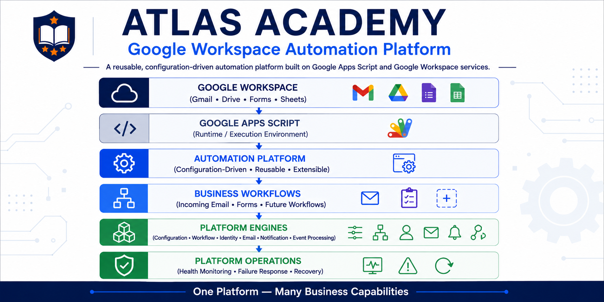
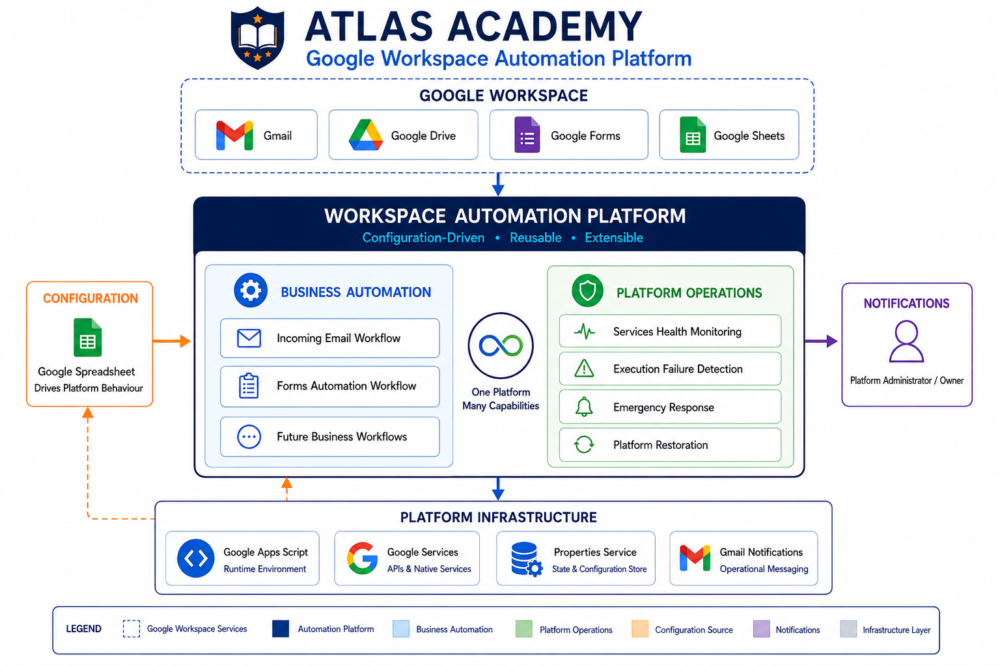
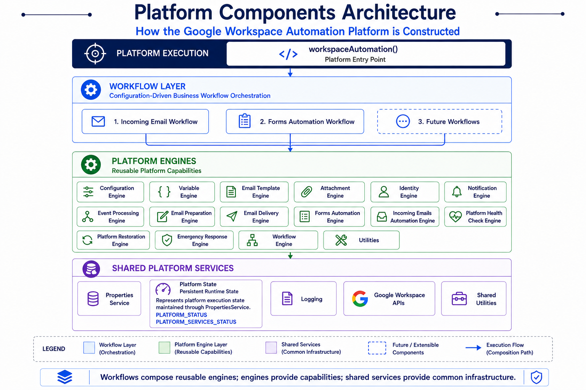
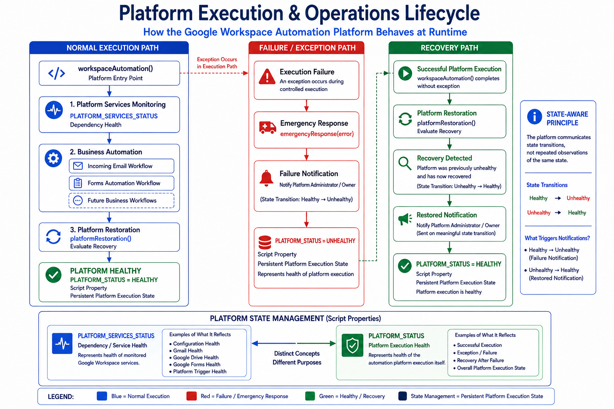

<p align="center">
  
</p>

<p align="center">
  
  
  
  
  
</p>

# Atlas Academy — Google Workspace Automation Platform

> A configuration-driven Google Workspace automation platform designed to orchestrate reusable capabilities into business workflows while maintaining platform health, operational awareness, and recovery.

---

## Platform Overview

The **Atlas Academy Google Workspace Automation Platform** provides a reusable automation foundation for building and operating business workflows across Google Workspace services.

Rather than implementing each automation as an independent script, the platform separates:

- Configuration
- Business workflows
- Reusable platform engines
- Platform operations
- Shared infrastructure
- State management
- Notifications
- Failure and recovery handling

This allows different business workflows to operate through the same underlying platform capabilities.

The platform is implemented using **Google Apps Script** and integrates with Google Workspace services such as Gmail, Google Drive, Google Forms, and Google Sheets.

---

## Why This Platform Exists

Business processes built around Google Workspace often begin as small automation scripts.

As requirements grow, those scripts can quickly become tightly coupled to:

- Business-specific logic
- Email templates
- Recipients
- Google Workspace resources
- Configuration values
- Notification logic
- Error handling
- State management

This makes every new automation increasingly difficult to maintain.

The Atlas Academy platform addresses this by separating **business workflow orchestration** from **reusable platform capabilities**.

The result is a platform where:

> **New business workflows can be introduced by composing existing capabilities rather than rebuilding the underlying automation infrastructure.**

---

## Platform Architecture

The platform is organized around a simple architectural principle:

```text
Configuration
      │
      ▼
Reusable Platform Capabilities
      │
      ▼
Business Workflows
      │
      ▼
Business Outcomes

        +

Platform Operations
      │
      ├── Health Monitoring
      ├── Failure Detection
      ├── Emergency Response
      └── Recovery
```

The same platform architecture can therefore orchestrate fundamentally different business workflows by composing reusable platform capabilities.

### Platform Architecture Diagram

The following diagram provides the high-level architectural view of the complete platform.



The architecture separates the platform into:

- Google Workspace services
- Configuration
- Business automation
- Platform operations
- Platform infrastructure
- Operational notifications

This separation allows the platform to evolve without requiring every business workflow to own its own infrastructure or operational mechanisms.

---

## Platform Components

The platform is composed of several layers that work together during execution.

```text
Platform Execution
        │
        ▼
Workflow Layer
        │
        ▼
Reusable Platform Engines
        │
        ▼
Shared Platform Services
        │
        ▼
Google Workspace APIs
```

Business workflows coordinate the execution of reusable capabilities.

Platform engines provide those capabilities.

Shared services provide the common infrastructure required by those engines.

### Platform Components Architecture Diagram

The following diagram presents the major implementation layers and the reusable engines that compose the platform.



The components architecture separates:

- **Workflow orchestration**
- **Reusable platform capabilities**
- **Shared platform infrastructure**

This allows workflows to remain focused on business outcomes while reusable engines handle common technical responsibilities.

---

## Business Workflows

The platform currently supports two implemented business workflows:

```text
                    Platform
                       │
              ┌────────┴────────┐
              │                 │
              ▼                 ▼
     Incoming Email          Forms
       Automation           Automation
              │                 │
              ▼                 ▼
      Customer Reply       Respondent
                           Acknowledgement
              │                 │
              └────────┬────────┘
                       ▼
                Business Outcomes
```

Both workflows consume reusable platform capabilities rather than implementing every technical responsibility independently.

---

## Incoming Email Automation

The Incoming Email Automation workflow processes configured Gmail conversations and produces coordinated business outcomes.

```text
Incoming Gmail Conversation
          │
          ▼
Incoming Email Workflow
          │
          ├── Event Processing
          ├── Configuration
          ├── Variables
          ├── Template Processing
          ├── Identity
          ├── Email Preparation
          └── Email Delivery
                    │
             ┌──────┴──────┐
             ▼             ▼
       Customer Reply   Business
                        Notification
```

The workflow is configuration-driven and uses reusable platform capabilities rather than embedding every technical responsibility directly into the workflow implementation.

The result is an automated customer communication flow with an independent internal notification path.

---

## Forms Automation

Forms Automation extends the same platform architecture to structured Google Form submissions.

```text
Google Form Submission
          │
          ▼
Forms Workflow
          │
          ├── Form Configuration
          ├── Response Processing
          ├── Event Processing
          ├── Respondent Variables
          ├── Template Processing
          ├── Identity
          └── Email Delivery
                    │
             ┌──────┴──────┐
             ▼             ▼
       Respondent       Business
       Acknowledgement  Notification
```

The trigger and business context are different from Incoming Email Automation, but the workflow continues to consume the same reusable platform capabilities.

This demonstrates the central business automation principle:

> **Different business events can enter through different workflows while continuing to consume the same reusable platform capabilities.**

---

## Configuration-Driven Design

Platform behavior is driven by centralized configuration rather than hardcoded business values.

The configuration repository defines values such as:

- Email aliases
- Email templates
- Google Forms
- Notification recipients
- Organization settings
- Processed event information
- Attachments and document references

Conceptually:

```text
Administrator
      │
      ▼
Configuration Repository
      │
      ▼
Configuration Engine
      │
      ▼
Runtime Configuration
      │
      ▼
Business Workflows
```

This allows configuration changes to be introduced without requiring changes to the underlying workflow implementation.

The platform can therefore be adapted for different business environments while preserving the same automation architecture.

---

## Runtime Execution

All platform execution is coordinated through the primary runtime entry point:

```text
workspaceAutomation()
```

The execution lifecycle follows a controlled boundary:

```text
workspaceAutomation()
        │
        ▼
Platform Services Monitoring
        │
        ▼
Business Automation
        │
        ▼
Platform Restoration
        │
        ▼
Execution Complete
```

If an exception occurs during controlled execution, the platform transfers control to the emergency response path.

```text
                    workspaceAutomation()
                              │
             ┌────────────────┴────────────────┐
             │                                 │
             ▼                                 ▼
       Normal Execution                  Exception Path
             │                                 │
             ▼                                 ▼
   Platform Services Monitoring          Emergency Response
                                               │
             │                                 ▼
             ▼                           Failure Notification
   Business Automation                         │
             │                                 ▼
             ▼                           PLATFORM_STATUS
   Platform Restoration
```

### Platform Execution & Operations Lifecycle

The following diagram represents the runtime behavior of the platform, including normal execution, failure handling, persistent execution state, and recovery.



The platform therefore treats execution as a lifecycle rather than as a single isolated automation run.

---

## Platform Operations

Business automation is only one responsibility of the platform.

The platform also maintains awareness of the operational conditions required for that automation to execute successfully.

### Service Health Monitoring

Required Google Workspace dependencies are evaluated before business workflows execute.

The platform maintains service health separately through:

```text
PLATFORM_SERVICES_STATUS
```

This represents the health of monitored platform dependencies.

Examples include:

- Gmail
- Google Drive
- Google Forms
- Configuration
- Platform Trigger

The platform evaluates individual service results and determines the resulting platform services health state.

---

## Platform Execution State

The platform separately maintains its own execution state through:

```text
PLATFORM_STATUS
```

This represents the health of the automation platform itself.

The distinction is intentional:

```text
PLATFORM_SERVICES_STATUS
        │
        └── Health of required services


PLATFORM_STATUS
        │
        └── Health of platform execution
```

A service can therefore become unavailable independently of an execution failure, while a platform execution can also fail because of application logic, runtime errors, or other execution conditions.

This separation allows platform operations to reason about dependency health and platform execution health independently.

---

## Failure and Recovery

The platform is designed to communicate meaningful operational state transitions rather than repeatedly report the same condition.

A platform failure follows the operational path:

```text
Healthy
   │
   │ Execution Failure
   ▼
Unhealthy
   │
   ▼
Emergency Response
   │
   ▼
Failure Notification
   │
   ▼
Recovery
   │
   ▼
Restored Notification
   │
   ▼
Healthy
```

The platform uses persistent execution state to distinguish:

```text
Healthy → Unhealthy
```

from:

```text
Unhealthy → Unhealthy
```

and:

```text
Unhealthy → Healthy
```

This prevents repeated notifications for an unchanged condition while ensuring that meaningful failure and recovery transitions are communicated.

> **A platform that can detect failure is operationally useful. A platform that can communicate failure and recognize recovery is operationally resilient.**

---

## Engineering Principles

The platform is built around a small set of engineering principles that guide its implementation and future evolution.

### Configuration Over Hardcoding

Business-specific values belong in configuration wherever practical rather than being embedded directly into workflow logic.

### Reusable Capabilities

Common technical responsibilities are implemented once and reused by multiple workflows.

### Workflow Orchestration

Business workflows coordinate reusable capabilities instead of owning every implementation detail themselves.

### Separation of Concerns

Configuration, business workflows, platform engines, infrastructure, and operational responsibilities remain independently understandable.

### Idempotent Event Processing

Previously processed business events can be recognized and skipped to prevent duplicate business processing.

### State-Aware Operations

The platform communicates meaningful state transitions rather than repeatedly reporting the same state.

### Platform Reliability

Health monitoring, failure detection, notification, and recovery are treated as platform capabilities rather than features belonging to a single business workflow.

### Extensibility

New business workflows can be introduced by composing existing capabilities and adding workflow-specific logic where required.

> **Platform growth does not necessarily require platform complexity to grow at the same rate.**

---

## Repository Structure

The repository is organized around the platform implementation, configuration, deployment, design documentation, and source code.

```text
google-workspace-automation-platform/
│
├── configuration/
│   ├── Atlas_Workspace_Automation_Platform.xlsx
│   └── README.md
│
├── deployment/
│   └── README.md
│
├── design_diagrams/
│   ├── 01_Architecture_Diagrams/
│   ├── 02_Platform_Components/
│   ├── 03_Platform_Workflows/
│   ├── 04_Configuration_Diagrams/
│   └── README.md
│
├── source_code/
│   ├── AttachmentsEngine.js
│   ├── ConfigurationEngine.js
│   ├── Constants.js
│   ├── EmailEngine.js
│   ├── EmailTemplatesEngine.js
│   ├── EmergencyResponseEngine.js
│   ├── EventProcessingEngine.js
│   ├── FormsAutomationEngine.js
│   ├── IdentityEngine.js
│   ├── IncomingEmailsAutomationEngine.js
│   ├── main.js
│   ├── NotificationEngine.js
│   ├── PlatformHealthCheckEngine.js
│   ├── PlatformRestorationEngine.js
│   ├── README.md
│   ├── Utilities.js
│   ├── VariableEngine.js
│   └── WorkflowEngine.js
│
└── README.md
```

The source implementation is organized around reusable engines and supporting modules rather than around individual business workflows.

The documentation is separated into focused guides so that implementation, configuration, deployment, and architectural design can each be understood independently.

---

## Documentation

The repository contains dedicated documentation for the major aspects of the platform.

### Configuration Guide

The Configuration Guide explains how platform behavior is controlled through the centralized configuration repository.

[Explore the Configuration Guide →](configuration/README.md)

### Source Code Guide

The Source Code Guide explains how the platform is implemented and how the complete runtime lifecycle is orchestrated through the source code.

It covers:

- Runtime execution
- Platform services monitoring
- Business workflow orchestration
- Incoming Email Automation
- Forms Automation
- Event processing
- Failure handling
- Emergency Response
- Platform Restoration
- State-aware operations

[Explore the Source Code Guide →](source_code/README.md)

### Design Diagrams

The Design Diagrams Guide provides access to the architectural, component, workflow, and configuration diagrams used to describe the platform visually.

[Explore the Design Diagrams →](design_diagrams/README.md)

### Deployment Guide

The Deployment Guide explains how the platform is prepared, deployed, and maintained in the target Google Workspace environment.

[Explore the Deployment Guide →](deployment/README.md)

---

## Technology Foundation

The platform is built around the following technologies and services:

- Google Apps Script
- Google Workspace APIs
- Gmail
- Google Drive
- Google Forms
- Google Sheets
- Google Apps Script Properties Service
- JavaScript

The platform uses Google Workspace as both the execution ecosystem and the business automation environment.

---

## Current Capabilities

The platform currently provides:

- Configuration-driven automation
- Centralized configuration repository
- Reusable platform engines
- Incoming Email Automation
- Forms Automation
- Event processing and duplicate-event protection
- Dynamic variable construction
- Template-driven communication
- Organization identity application
- Email delivery
- Attachment handling
- Business notifications
- Platform service health monitoring
- Persistent platform execution state
- Execution failure detection
- Emergency response
- Failure notifications
- Recovery detection
- Restoration notifications

---

## Future Extensibility

The platform is intentionally designed so that future business workflows can reuse the same underlying capabilities.

Potential future workflows could include:

```text
Payment Event
      │
      ▼
Business Workflow
      │
      ├── Configuration
      ├── Variables
      ├── Templates
      ├── Identity
      ├── Attachments
      ├── Email Preparation
      └── Email Delivery
```

Other potential consumers include:

- Payment-triggered communication
- Document distribution
- Registration workflows
- Approval workflows
- Reminder workflows
- Customer onboarding
- Internal operational notifications
- Additional Google Workspace-based business processes

The objective is not to create a separate automation platform for every business requirement.

The objective is to provide a reusable foundation that can compose existing capabilities into new workflows.

> **Build the capability once. Compose it into many workflows.**

---

## Platform Philosophy

The platform follows a simple engineering model:

```text
Entry Point
     │
     ▼
Coordinates Execution
     │
     ▼
Workflows
     │
     ▼
Compose Business Outcomes
     │
     ▼
Reusable Engines
     │
     ▼
Provide Capabilities
     │
     ▼
Shared Services
     │
     ▼
Provide Common Infrastructure
```

The result is a platform where business workflows remain understandable, reusable capabilities remain centralized, and operational responsibilities remain visible.

> **The entry point coordinates the lifecycle; engines perform the capabilities; workflows compose those capabilities into business outcomes.**

---

## Closing Perspective

The Atlas Academy Google Workspace Automation Platform is more than a collection of Google Apps Script automations.

It is a reusable automation foundation designed to:

- Separate configuration from implementation
- Separate workflows from platform capabilities
- Reuse technical capabilities across business processes
- Monitor the services required for execution
- Detect and communicate execution failures
- Maintain persistent execution state
- Recognize recovery
- Support future business workflows without rebuilding the platform

The currently implemented Incoming Email and Forms workflows demonstrate the architecture in practice.

They are not the boundary of the platform.

They are the first business consumers of a reusable automation foundation designed to grow with future requirements.

---

## Documentation Navigation

```text
                         README.md
                            │
          ┌─────────────────┼─────────────────┐
          │                 │                 │
          ▼                 ▼                 ▼
 Configuration        Source Code       Design Diagrams
    Guide                Guide               Guide
          │                 │                 │
          ▼                 ▼                 ▼
     Configure          Understand        Understand
    the Platform       Platform Code     Architecture
                            │
                            ▼
                     Deployment Guide
                            │
                            ▼
                     Deploy & Operate
```

Each guide provides a deeper view of a different part of the platform while this README serves as the starting point for understanding the overall system.

---

## Platform Summary

The platform brings together configuration, reusable engineering capabilities, business workflows, and operational resilience into a single automation foundation.

```text
                    GOOGLE WORKSPACE
                           │
                           ▼
                ┌─────────────────────┐
                │  AUTOMATION PLATFORM│
                └─────────────────────┘
                           │
          ┌────────────────┼────────────────┐
          │                │                │
          ▼                ▼                ▼
    Configuration     Workflows       Platform Operations
          │                │                │
          │                ▼                │
          │        Business Outcomes        │
          │                                 │
          └───────────────┬─────────────────┘
                          ▼
                 Reliable Automation
```

> **One platform. Reusable capabilities. Multiple business outcomes. Operational awareness built into the lifecycle.**

---

## Author

Built and maintained by **S M Nachiketha**, with a focus on automation engineering, platform architecture, DevOps, and reusable engineering systems.

For professional background and additional projects:

- [LinkedIn](https://www.linkedin.com/in/s-m-nachiketha-4b8878196/)
- [GitHub](https://github.com/nachichiyaan25)