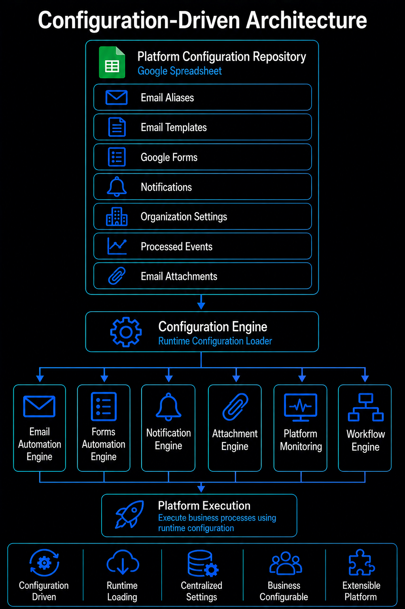
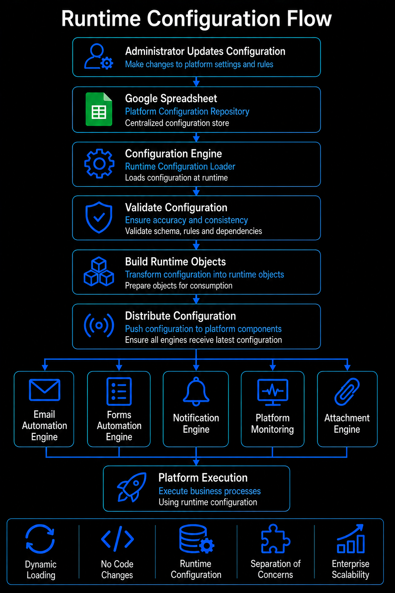

# Configuration Guide

## Overview

The Google Workspace Automation Platform follows a **configuration-driven architecture**, where operational behavior is controlled through a centralized Google Spreadsheet rather than hardcoded values inside the source code.

Business administrators can introduce new email aliases, update templates, modify forms, configure notifications, and adjust platform settings without changing the application logic. During execution, the Configuration Engine loads these sheets into memory and exposes them to the platform as runtime configuration.

---

## Why Configuration-Driven?

Traditional automation scripts often embed business rules directly inside the code.

```javascript
if(alias == "support@company.com"){
    ...
}
```

Every business change requires editing the source code and redeploying the application.

Instead, this platform separates **configuration from implementation**.

Business information resides inside a Google Spreadsheet, while the JavaScript engines simply consume that data during execution.

This separation allows administrators to update operational behavior without modifying platform code, reducing maintenance effort while improving long-term scalability.

---

## Configuration Architecture



The Google Spreadsheet acts as the centralized configuration repository for the entire platform.

Rather than reading static values from source files, the Configuration Engine loads configuration sheets during execution, transforms them into runtime objects, and provides them to the respective business engines. This allows every workflow to operate using the latest configuration without requiring application changes or redeployment.

---

## Configuration Sheets

| Sheet | Purpose |
|--------|---------|
| **01_Email_Aliases** | Email routing configuration |
| **02_Email_Templates** | Customer communication templates |
| **03_Google_Forms** | Google Forms integration |
| **04_Notifications** | Operational notification templates |
| **05_Organization_Settings** | Platform-wide settings |
| **06_Processed_Events** | Duplicate event prevention |
| **07_Email_Attachments** | Attachment mapping |

---

## 01 Email Aliases

Defines every business email alias monitored by the platform.

Each record specifies the responsible department, associated reply template, linked Google Form, notification recipients, processing priority, and automation status.

Adding a new department requires inserting a new configuration row without modifying application code.

---

## 02 Email Templates

Contains reusable customer communication templates used by the notification engine.

Templates support dynamic placeholders such as:

- `{{name}}`
- `{{formLink}}`

During execution, the Template Engine replaces these placeholders with runtime values before generating the final email.

---

## 03 Google Forms

Stores metadata required for Google Forms automation.

Each record contains:

- Form Name
- Form URL
- QR Code
- Acknowledgement Subject
- Response Template
- Notification Recipient
- Processing Status

This enables the platform to automatically process multiple independent forms using a common execution engine.

---

## 04 Notifications

Defines operational notifications generated by the platform.

These include:

- Incoming Email Notifications
- Form Submission Notifications
- Platform Services Health Notifications
- Platform Health Notifications

Notification templates remain fully configurable without modifying platform logic.

---

## 05 Organization Settings

Contains global platform settings shared across all business workflows.

Typical examples include:

- Organization Name
- Response SLA
- Default Signature
- Default Classification

Centralizing these values ensures consistency across all communications.

---

## 06 Processed Events

Maintains the execution history of processed Gmail messages and Google Form submissions.

Each processed event receives a unique identifier, preventing duplicate execution during scheduled platform runs.

This sheet enables exactly-once processing across business workflows.

---

## 07 Email Attachments

Maps attachment groups to Google Drive resources.

Instead of embedding document links directly inside templates, templates reference logical attachment groups.

The Attachment Engine resolves these groups during execution and retrieves the appropriate documents from Google Drive.

This design allows administrators to update distributed documents without modifying customer templates.

---

## Runtime Configuration Flow



### Runtime Flow

During platform execution, the Configuration Engine loads every configuration sheet into memory, validates the data, transforms it into runtime objects, and distributes the resulting configuration to the respective business engines.

Because configuration is loaded dynamically, changes become effective immediately during the next scheduled execution without requiring code modifications.

---

## Sample Configuration

The spreadsheet included in this repository contains **sample Atlas Academy configuration** using fictional email addresses, Google Forms, Google Drive links, and notification recipients.

Before deploying the platform, replace these sample values with your organization's actual configuration.

---

## Repository Contents

```text
configuration/
├── README.md
└── Atlas_Workspace_Automation_Platform.xlsx
```

The spreadsheet included in this repository represents a sample Atlas Academy configuration.

The accompanying **README** explains the purpose of every configuration sheet, allowing readers to understand the platform without inspecting individual spreadsheet tabs.

---

## Design Principles

- Configuration over Hardcoding
- Business-Friendly Administration
- Centralized Platform Settings
- Runtime Configuration Loading
- Separation of Business Rules and Implementation
- Extensible Configuration Model

---

## Repository Relationship

```text
README.md
   │
   ▼
Configuration Guide
(Platform Configuration)

   │
   ▼
Source Code Guide
(Platform Implementation)

   │
   ▼
Deployment Guide
(Platform Operations)
```

This Configuration guide explains **what the platform consumes**.

The Source Code Guide explains **how the platform consumes it**.

The Deployment Guide explains **how the platform is developed and deployed using Google Apps Script and clasp.**