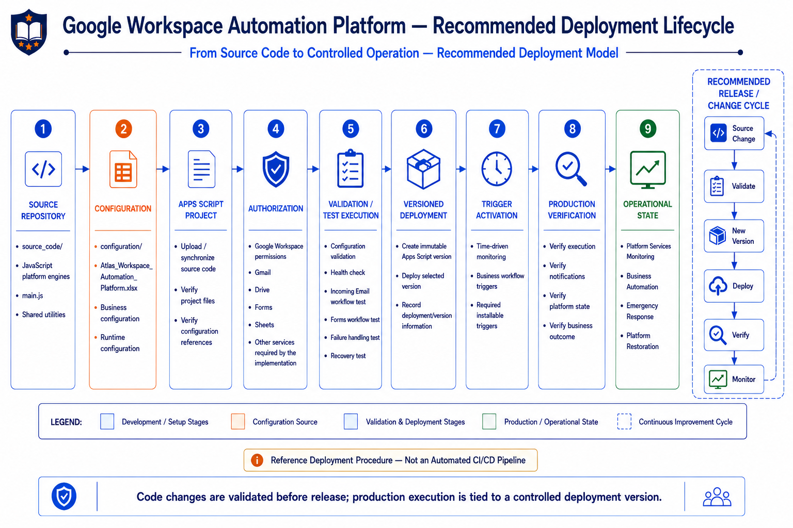

# Deployment Guide

This guide describes how to deploy and operate the **Google Workspace Automation Platform** as a Google Apps Script project.

The platform is developed as a modular Apps Script codebase and uses Google Workspace services as its runtime environment.

Deployment therefore involves more than uploading JavaScript files.

A successful deployment requires:

- Source code
- Platform configuration
- Google Workspace authorization
- Runtime validation
- Versioned deployment
- Trigger activation
- Post-deployment verification

The objective of this guide is to provide a recommended deployment process that moves the platform from source code into controlled operational execution.

> **Deployment Status**
>
> This guide documents the recommended deployment and release procedure for the
> Google Workspace Automation Platform. The current repository does not contain
> an automated CI/CD deployment pipeline. Versioned releases, trigger activation,
> production verification, and rollback are therefore described as controlled
> deployment practices rather than as automated capabilities currently implemented
> by the repository.

---

## Deployment Architecture

The platform deployment path can be understood as:

```text
Source Code
     │
     ▼
Configuration
     │
     ▼
Apps Script Project
     │
     ▼
Authorization
     │
     ▼
Validation
     │
     ▼
Versioned Deployment
     │
     ▼
Trigger Activation
     │
     ▼
Production Verification
     │
     ▼
Operational Platform
```

The deployment process prepares the platform for the same execution lifecycle described in the Source Code Guide:

```text
Platform Services Monitoring
          │
          ▼
Business Automation
          │
          ▼
Emergency Response
          │
          ▼
Platform Restoration
```

---

## RDeployment Lifecycle Diagram

The following diagram represents the complete deployment lifecycle of the platform.



The deployment lifecycle separates source preparation, configuration, authorization, validation, release, and operational verification.

This separation helps ensure that deployment problems are identified before the platform begins processing real business workflows.

---

# 1. Deployment Prerequisites

Before deploying the platform, ensure that the required Google Workspace environment and project resources are available.

## 1.1 Google Workspace Access

The deployment account must have access to the Google Workspace resources required by the platform.

Depending on the configured workflows, this may include:

- Gmail
- Google Drive
- Google Forms
- Google Sheets
- Google Calendar
- Google Apps Script

The exact services required depend on the capabilities enabled through configuration.

---

## 1.2 Google Apps Script Access

The deployment operator must have permission to access and manage the target Google Apps Script project.

The Apps Script project is the runtime environment in which the platform source code executes.

---

## 1.3 Configuration Repository

The repository contains the platform configuration under:

```text
configuration/
└── Atlas_Workspace_Automation_Platform.xlsx
```

The configuration defines business and platform behavior separately from the implementation.

This allows deployment to preserve the separation between:

```text
Implementation
      +
Configuration
      =
Runtime Behavior
```

Configuration should therefore be reviewed before deployment rather than treated as an afterthought.

---

# 2. Source Code Preparation

The source code for the platform is maintained under:

```text
source_code/
```

The directory contains the platform's reusable engines, workflow implementations, utilities, constants, and entry point.

A simplified view is:

```text
source_code/
│
├── main.js
├── ConfigurationEngine.js
├── WorkflowEngine.js
├── VariableEngine.js
├── IncomingEmailsAutomationEngine.js
├── FormsAutomationEngine.js
├── EmailTemplatesEngine.js
├── EmailEngine.js
├── NotificationEngine.js
├── AttachmentEngine.js
├── IdentityEngine.js
├── EventProcessingEngine.js
├── PlatformHealthCheckEngine.js
├── EmergencyResponseEngine.js
├── PlatformRestorationEngine.js
├── Utilities.js
├── Constants.js
└── ...
```

Before deployment, verify that the intended source version contains all required files.

---

# 3. Source Code Validation

Before uploading or deploying the project, review the source code for obvious implementation problems.

At minimum, verify:

- Required files are present
- The platform entry point exists
- Engine imports or references are correct
- Function names are consistent
- Configuration references are correct
- No temporary test code remains
- No debugging-only behavior remains enabled
- No sensitive credentials are hardcoded
- No obsolete configuration values are being referenced

The goal of this step is to catch implementation problems before they become runtime failures.

---

# 4. Configuration Preparation

The platform follows a configuration-driven architecture.

Business-specific values should be maintained in the configuration source rather than embedded directly into workflow logic wherever practical.

Before deployment, review the configuration for:

- Business aliases
- Email templates
- Recipients
- Notification settings
- Google Workspace identifiers
- Forms configuration
- Drive locations
- Workflow enablement
- Platform service configuration
- Health monitoring configuration
- Other environment-specific values

The configuration should represent the intended environment in which the platform will execute.

---

# 5. Configuration Validation

Configuration should be validated before activating the platform.

The objective is to ensure that the platform can successfully resolve the values required during runtime.

A useful validation sequence is:

```text
Load Configuration
       │
       ▼
Resolve Required Values
       │
       ▼
Validate Configuration
       │
       ├── Invalid ──► Correct Configuration
       │
       └── Valid
            │
            ▼
       Continue Deployment
```

Configuration problems should be corrected before production workflow execution is enabled.

---

# 6. Google Apps Script Project Preparation

The platform executes inside a Google Apps Script project.

The deployment process therefore requires the source code to be available in the target Apps Script project.

The project should be reviewed after the source is uploaded or synchronized.

Verify that:

- Expected source files are present
- `main.js` is available
- Required engine files are present
- The project opens successfully
- No source files are missing
- The latest intended code is present

The Apps Script project should be treated as the runtime representation of the source repository.

---

# 7. Authorization

Google Apps Script requires authorization when the script accesses protected Google services.

The first execution of functionality requiring authorization may require the user to grant the required permissions.

The required permissions depend on the services used by the implementation.

Examples include access to:

- Gmail
- Google Drive
- Google Sheets
- Google Forms
- Other Google Workspace services used by the platform

Authorization should be completed using the intended deployment account.

This is particularly important for installable triggers because installable triggers execute using the authorization of the account that created them. :contentReference[oaicite:1]{index=1}

---

# 8. Authorization Verification

After authorization, execute a controlled test of the platform.

The purpose is not yet to process real business traffic.

Instead, verify that:

```text
Platform Code
     │
     ▼
Google Workspace Services
     │
     ▼
Required Permissions
     │
     ▼
Successful Execution
```

If authorization is incomplete, the platform may fail when an engine attempts to access a protected service.

Authorization problems should therefore be resolved before production triggers are activated.

---

# 9. Initial Platform Validation

Before activating normal business automation, validate the platform's operational foundation.

The first validation should focus on:

### Platform Services Health

Verify that the required Google Workspace services can be evaluated successfully.

The platform distinguishes service dependency health from platform execution health:

```text
PLATFORM_SERVICES_STATUS
        │
        ▼
Dependency / Service Health
```

versus:

```text
PLATFORM_STATUS
        │
        ▼
Platform Execution Health
```

These represent different operational concepts and should not be treated as interchangeable.

---

# 10. Business Workflow Validation

Once the platform services are healthy, validate the implemented business workflows.

The current platform contains:

```text
Incoming Email Automation
        │
        └── Incoming Email Workflow

Forms Automation
        │
        └── Forms Automation Workflow
```

Each workflow should be tested independently before production activation.

---

# 11. Incoming Email Workflow Validation

Validate the Incoming Email workflow using a controlled test message.

The test should verify the complete workflow:

```text
Incoming Email
      │
      ▼
Event Processing
      │
      ▼
Email Context
      │
      ▼
Workflow Orchestration
      │
      ▼
Reusable Platform Engines
      │
      ▼
Email Preparation
      │
      ▼
Email Delivery
      │
      ▼
Customer / Business Outcome
```

Where applicable, also verify the independent notification branch.

The test should confirm that the platform produces the expected business communication without creating duplicate processing.

---

# 12. Forms Workflow Validation

Validate the Forms Automation workflow using a controlled form submission.

The expected flow is:

```text
Form Submission
      │
      ▼
Form Response Processing
      │
      ▼
Event Validation
      │
      ▼
Workflow Orchestration
      │
      ▼
Reusable Platform Engines
      │
      ▼
Acknowledgement / Notification
      │
      ▼
Business Outcome
```

Verify that:

- The form response is detected
- The event is processed correctly
- Duplicate processing is prevented
- Required configuration is resolved
- The expected acknowledgement is generated
- Required notifications are delivered
- The expected business outcome is produced

---

# 13. Failure Handling Validation

Deployment validation should not stop at successful execution.

The platform also contains an operational failure path.

A controlled failure test should verify that an execution exception can move through the platform's emergency response lifecycle.

Conceptually:

```text
Execution Failure
       │
       ▼
Emergency Response
       │
       ▼
Failure Context
       │
       ▼
State Evaluation
       │
       ▼
Failure Notification
       │
       ▼
PLATFORM_STATUS = UNHEALTHY
```

The objective is to verify that an operational failure becomes visible to the platform administrator or owner.

---

# 14. Recovery Validation

The recovery path should also be validated.

A successful execution after a previous failure should allow the platform to recognize the recovery transition.

```text
Previous State
UNHEALTHY
      │
      ▼
Successful Execution
      │
      ▼
Recovery Detection
      │
      ▼
PLATFORM_STATUS = HEALTHY
      │
      ▼
Recovery Notification
```

The platform therefore communicates meaningful state transitions rather than repeatedly reporting the same state.

The important transitions are:

```text
Healthy   → Unhealthy
Unhealthy → Healthy
```

Unchanged states should not continuously generate equivalent operational notifications.

---

# 15. Versioned Deployment

Once validation is complete, create a controlled deployment version.

Google Apps Script distinguishes between the current head deployment and versioned deployments.

A head deployment follows the current saved project code and is intended for testing.

A versioned deployment points to a specific project version and is intended for controlled use. :contentReference[oaicite:2]{index=2}

The release process should therefore follow:

```text
Validated Source
      │
      ▼
Create Version
      │
      ▼
Deploy Version
      │
      ▼
Record Deployment Information
      │
      ▼
Production Verification
```

A version represents a static snapshot of the project code. Once created, that version is immutable. :contentReference[oaicite:3]{index=3}

---

# 16. Deployment Information

For every production deployment, record enough information to identify what was released.

Recommended information includes:

```text
Deployment Date:
Deployment Version:
Deployment Description:
Source Commit / Reference:
Configuration Version:
Deployment Operator:
Validation Status:
```

This creates a basic release history that can be used during troubleshooting or future recovery.

---

# 17. Trigger Activation

The platform depends on automated execution mechanisms to initiate its workflows.

Apps Script supports installable triggers, including time-driven triggers and event-driven triggers. :contentReference[oaicite:4]{index=4}

Triggers should be activated only after the deployment has passed validation.

A typical activation sequence is:

```text
Deployment Verified
       │
       ▼
Create / Verify Triggers
       │
       ▼
Confirm Trigger Functions
       │
       ▼
Confirm Trigger Authorization
       │
       ▼
Enable Operational Execution
```

---

# 18. Platform Monitoring Trigger

The platform health monitoring process should run according to its configured schedule.

The monitoring cycle evaluates the required platform services and updates:

```text
PLATFORM_SERVICES_STATUS
```

The monitoring process therefore establishes the dependency health context used by the broader platform.

---

# 19. Business Workflow Triggers

Business workflow triggers should be verified according to the workflow implementation.

The deployment operator should confirm:

- The intended trigger exists
- The trigger points to the correct function
- The trigger is enabled
- The trigger executes under the intended authorization
- The trigger does not create duplicate executions
- The workflow receives the expected event

Installable triggers execute using the authorization of the account that created them, so trigger ownership should be considered part of deployment configuration. :contentReference[oaicite:5]{index=5}

---

# 20. Post-Deployment Verification

After trigger activation, perform an end-to-end production verification.

The verification should cover:

### Platform Health

```text
Platform Services
       │
       ▼
Health Check
       │
       ▼
PLATFORM_SERVICES_STATUS
```

### Business Automation

```text
Business Event
       │
       ▼
Workflow Execution
       │
       ▼
Expected Business Outcome
```

### Operational Response

```text
Failure
   │
   ▼
Emergency Response
   │
   ▼
Notification
   │
   ▼
Recovery
```

The objective is to confirm that the deployed platform behaves as designed rather than merely confirming that the Apps Script project exists.

---

# 21. Production Smoke Test

A production smoke test should verify the minimum critical execution path.

Recommended sequence:

```text
1. Confirm deployment version
        │
        ▼
2. Confirm triggers
        │
        ▼
3. Confirm platform service health
        │
        ▼
4. Execute controlled business test
        │
        ▼
5. Verify expected output
        │
        ▼
6. Verify notification behavior
        │
        ▼
7. Verify execution logs
        │
        ▼
8. Confirm platform state
```

Only after these checks should the deployment be considered operationally verified.

---

# 22. Monitoring After Deployment

Deployment does not end when the script is released.

The platform is designed to continue observing its operational condition during runtime.

The operational lifecycle is:

```text
Monitor
   │
   ▼
Execute
   │
   ▼
Detect
   │
   ▼
Respond
   │
   ▼
Recover
   │
   ▼
Resume
```

This is why platform health monitoring, emergency response, and restoration are implemented as reusable platform capabilities rather than as isolated workflow behavior.

---

# 23. Change Management

When source code changes are introduced, the deployment process should be repeated rather than modifying production behavior without validation.

The recommended change cycle is:

```text
Source Change
     │
     ▼
Code Review
     │
     ▼
Configuration Review
     │
     ▼
Validation
     │
     ▼
Test Execution
     │
     ▼
Create New Version
     │
     ▼
Deploy
     │
     ▼
Post-Deployment Verification
```

The existing production deployment should remain identifiable while the new version is being validated.

---

# 24. Updating an Existing Deployment

When a validated code change is ready for release:

```text
Existing Deployment
        │
        ▼
New Validated Source
        │
        ▼
Create New Version
        │
        ▼
Update Deployment
        │
        ▼
Verify Production
```

Apps Script versioned deployments are associated with a specific project version. Updating the deployed application therefore involves creating a new version and updating the deployment to use that version. :contentReference[oaicite:6]{index=6}

---

# 25. Rollback Strategy

If a newly deployed version introduces an unexpected problem, the deployment should be restored to a previously validated version.

Conceptually:

```text
Production Problem
       │
       ▼
Identify Current Version
       │
       ▼
Identify Last Known Good Version
       │
       ▼
Restore / Redeploy Known Good Version
       │
       ▼
Validate
       │
       ▼
Resume Operations
```

The purpose of versioned deployments is not only controlled release.

They also provide a clear boundary between known versions of the platform.

Version history can be reviewed through Apps Script project history, while deployments can be managed through the Apps Script deployment interface. :contentReference[oaicite:7]{index=7}

---

# 26. Deployment Failure Handling

Deployment failures should be classified before corrective action is taken.

Common categories include:

| Failure Category | Example |
|---|---|
| Source Failure | Missing or invalid source file |
| Configuration Failure | Invalid configuration value |
| Authorization Failure | Required Google service permission unavailable |
| Trigger Failure | Trigger missing, disabled, or incorrectly configured |
| Runtime Failure | Engine exception during execution |
| Service Failure | Required Google Workspace service unavailable |
| Workflow Failure | Business workflow cannot complete |
| Recovery Failure | Platform cannot return to expected state |

The platform's operational mechanisms are designed primarily for runtime failures.

Deployment failures should be resolved before production execution is enabled.

---

# 27. Logs and Execution Verification

After deployment, execution history should be reviewed to confirm that the platform is behaving as expected.

Verify:

- Expected functions are executing
- No unexpected exceptions are occurring
- Required services are accessible
- Business workflows complete successfully
- Notifications are generated correctly
- Health state changes are recorded
- Recovery behavior is functioning correctly

Apps Script execution history provides information about script executions and failures and should be used as part of post-deployment verification. :contentReference[oaicite:8]{index=8}

---

# 28. Security Considerations

Deployment should preserve the separation between source code, configuration, and credentials.

Do not commit:

- Passwords
- OAuth secrets
- API keys
- Private credentials
- Access tokens
- Sensitive production data

Business configuration should also be reviewed before committing it to a public repository.

The public repository should contain the platform implementation and documentation without exposing credentials or secrets required to operate a real environment.

---

# 29. Production Deployment Checklist

Use the following checklist before considering a deployment complete.

## Source

- [ ] Intended source version identified
- [ ] Required engine files present
- [ ] Entry point verified
- [ ] No temporary debugging code remains
- [ ] No credentials are hardcoded

## Configuration

- [ ] Configuration reviewed
- [ ] Required identifiers verified
- [ ] Business configuration validated
- [ ] Notification configuration verified
- [ ] Health monitoring configuration verified

## Authorization

- [ ] Required Google Workspace permissions granted
- [ ] Deployment account verified
- [ ] Trigger authorization verified

## Validation

- [ ] Platform health check succeeds
- [ ] Incoming Email workflow tested
- [ ] Forms workflow tested
- [ ] Failure path tested
- [ ] Recovery path tested

## Deployment

- [ ] Version created
- [ ] Deployment updated
- [ ] Deployment information recorded

## Triggers

- [ ] Required triggers exist
- [ ] Trigger functions are correct
- [ ] Trigger ownership is correct
- [ ] Trigger authorization is correct

## Production Verification

- [ ] Smoke test completed
- [ ] Expected business outcome verified
- [ ] Notifications verified
- [ ] Execution history reviewed
- [ ] Platform state verified

---

# 30. Operational Handover

A deployment should be considered complete only when the operational owner can identify:

```text
What was deployed?
        │
        ▼
Which version?
        │
        ▼
Which configuration?
        │
        ▼
Which triggers?
        │
        ▼
Who owns the deployment?
        │
        ▼
How is platform health monitored?
        │
        ▼
How are failures communicated?
        │
        ▼
How is recovery detected?
```

This information allows the platform to transition from a development artifact into an operational service.

---

# 31. Deployment and Platform Reliability

The deployment process is deliberately aligned with the platform's reliability model.

The platform does not treat deployment as the end of engineering responsibility.

Instead:

```text
Deploy
  │
  ▼
Verify
  │
  ▼
Monitor
  │
  ▼
Detect
  │
  ▼
Respond
  │
  ▼
Recover
  │
  ▼
Improve
```

This creates a continuous operational lifecycle around the platform.

A deployment is successful only when the released platform can execute its intended workflows and maintain awareness of its own operational state.

---

# 32. Deployment Philosophy

The platform follows a controlled deployment principle:

> **Validate the platform before release, release a known version, verify the runtime behavior, and keep the deployed state identifiable.**

This allows source code, configuration, deployment, and runtime operations to remain separate but connected.

The result is a deployment process that supports both business automation and operational reliability.

---

# 33. Deployment Lifecycle Summary

The complete deployment process can be summarized as:

```text
Source Code
     │
     ▼
Configuration
     │
     ▼
Apps Script Project
     │
     ▼
Authorization
     │
     ▼
Validation
     │
     ▼
Versioned Deployment
     │
     ▼
Trigger Activation
     │
     ▼
Production Verification
     │
     ▼
Platform Monitoring
     │
     ▼
Business Automation
     │
     ▼
Emergency Response
     │
     ▼
Platform Restoration
     │
     ▼
Normal Operations
```

The deployment lifecycle therefore connects the repository directly to the operational lifecycle described throughout the platform documentation.

---

# Final Perspective

The Google Workspace Automation Platform is not deployed as a collection of independent scripts.

It is deployed as a coordinated platform consisting of:

- Configuration
- Reusable platform engines
- Business workflows
- Shared Google Workspace services
- Operational monitoring
- Failure handling
- Recovery mechanisms

Deployment establishes the controlled boundary between the engineering source and the running platform.

Once deployed, the platform continues through its normal operational lifecycle:

```text
Healthy
   │
   ▼
Execute
   │
   ├──────────────► Failure
   │                    │
   │                    ▼
   │             Emergency Response
   │                    │
   │                    ▼
   │             Failure Notification
   │                    │
   │                    ▼
   │             Platform Restoration
   │                    │
   │                    ▼
   └────────────── Healthy
```

> **Deployment puts the platform into operation. Monitoring tells us whether it remains operational. Emergency response tells us when it does not. Restoration brings it back.**

That completes the deployment lifecycle of the Google Workspace Automation Platform.