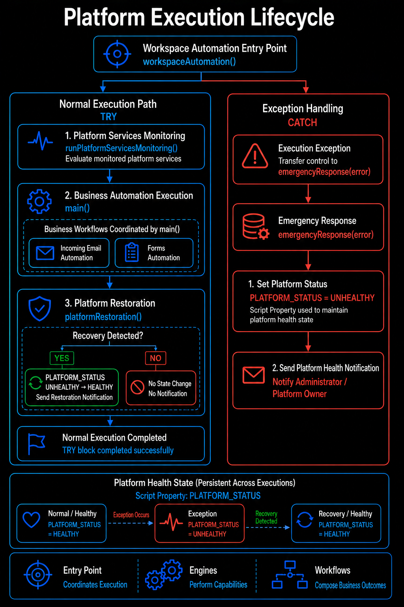
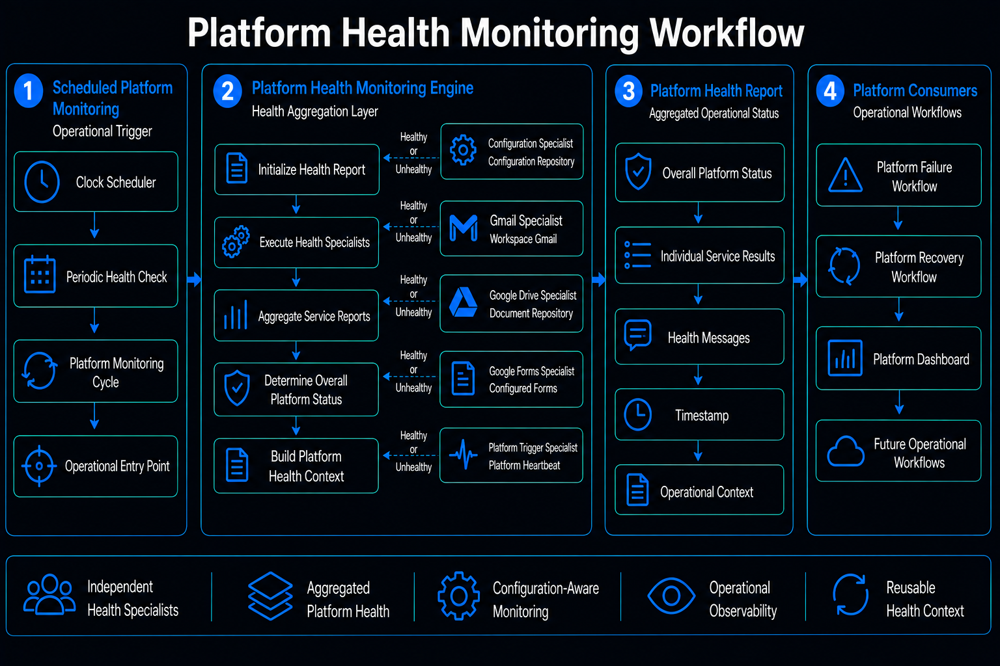
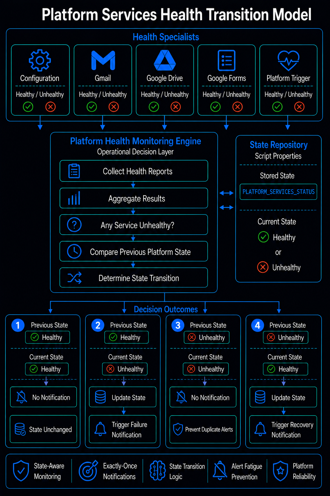
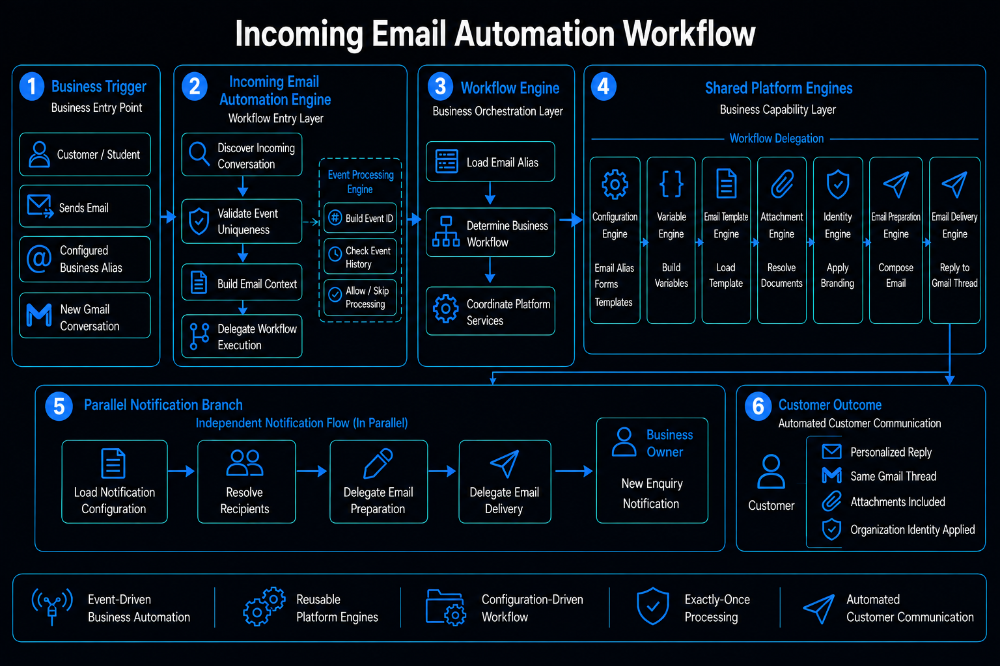
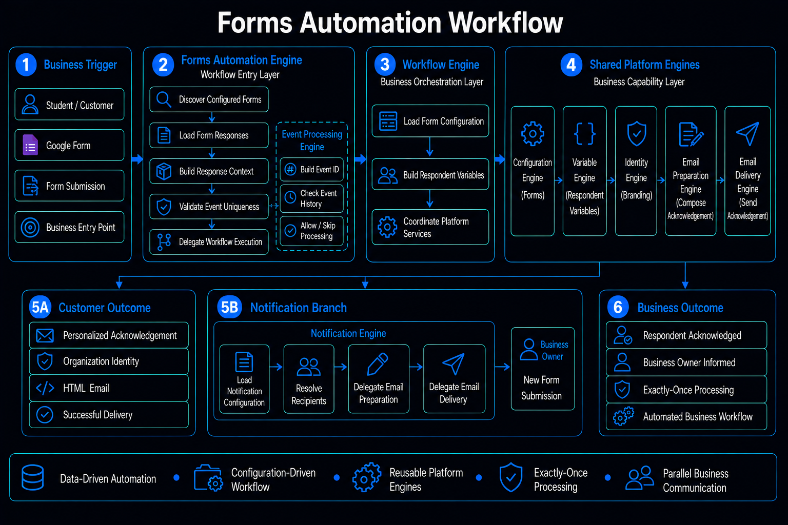
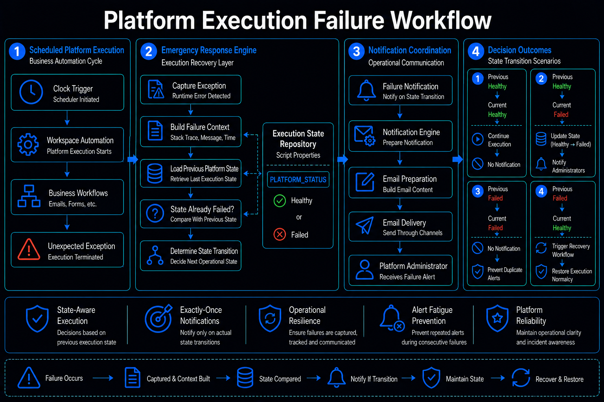
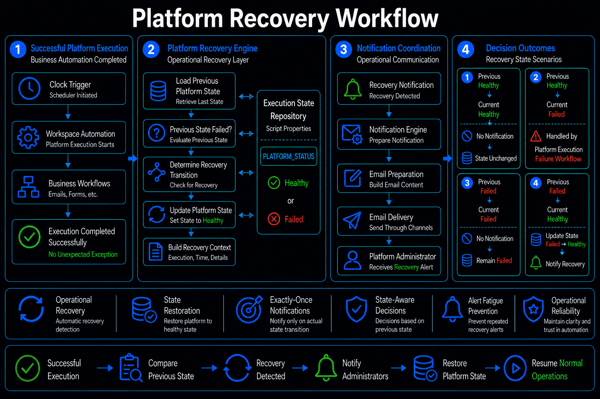

# Source Code Guide

## 1. Overview

The Workspace Automation Platform is implemented as a collection of independent **JavaScript engines** that collaborate to automate business operations through a configuration-driven architecture.

Rather than concentrating all business logic into a few large files, the platform distributes responsibilities across specialized engines. Each engine performs a single responsibility—such as email processing, Google Forms automation, notification delivery, runtime configuration, platform monitoring, or workflow orchestration—while collaborating through shared platform services.

This modular architecture allows individual platform capabilities to evolve independently without affecting unrelated components. New business workflows are introduced by composing existing platform engines instead of redesigning the application.

Throughout this guide, we explore how these engines collaborate during execution, how responsibilities are separated, and how the complete platform automation lifecycle is coordinated from a single platform entry point.

---

## 2. Intended Audience

This guide is intended for developers and software engineers who want to understand how the Workspace Automation Platform is implemented internally.

Unlike the Configuration Guide, which explains the runtime configuration consumed by the platform, this document focuses on the implementation architecture, engine responsibilities, execution lifecycle, and collaboration between the platform components.

Whether extending the platform, reviewing the implementation, or understanding the overall source code architecture, this guide provides a structured walkthrough of the complete Workspace Automation Platform.

---

## 3. Repository Relationship

```text
README.md
     │
     ▼
Configuration Guide
     │
     ▼
Source Code Guide
     │
     ▼
Deployment Guide
```

The **Main README** introduces the Workspace Automation Platform and provides a high-level overview of its capabilities, architecture, and business value.

The **Configuration Guide** explains how business rules, templates, notifications, and platform settings are managed through centralized configuration.

This **Source Code Guide** explains how that configuration is consumed by the platform through independent runtime engines and coordinated business workflows.

Finally, the **Deployment Guide** explains how the Workspace Automation Platform is developed, synchronized, deployed, and maintained using Google Apps Script and `clasp`.

---

## 4. Repository Structure

```text
source_code/

├── AttachmentsEngine.js
├── ConfigurationEngine.js
├── Constants.js
├── EmailEngine.js
├── EmailTemplatesEngine.js
├── EmergencyResponseEngine.js
├── EventProcessingEngine.js
├── FormsAutomationEngine.js
├── IdentityEngine.js
├── IncomingEmailsAutomationEngine.js
├── NotificationEngine.js
├── PlatformHealthCheckEngine.js
├── PlatformRestorationEngine.js
├── Utilities.js
├── VariableEngine.js
├── WorkflowEngine.js
└── README.md
```

Each JavaScript file represents either a reusable platform engine or a supporting module within the platform architecture.

Rather than organizing code around individual business workflows, the platform organizes its implementation around reusable platform services. Business workflows are constructed by orchestrating these independent engines during runtime, resulting in a modular, extensible, and maintainable architecture.

Throughout this guide, these engines are presented according to their role within the platform execution lifecycle rather than their physical location inside the repository. This approach reflects how the platform actually executes, allowing readers to understand the implementation from a runtime perspective instead of navigating individual source files.

---

## 5. Engineering Principles

The Workspace Automation Platform is designed around a set of engineering principles that govern how its source code is structured, how individual engines interact, and how future business workflows can be introduced.

These principles ensure that the platform remains modular, maintainable, extensible, and configuration-driven as new automation requirements are introduced.

The objective is not to create a separate implementation for every business requirement, but to provide reusable platform capabilities that can be orchestrated into different workflows as required.

### 5.1 Single Responsibility

Each engine is responsible for one clearly defined capability.

For example:

- **Configuration Engine** — Loads and transforms platform configuration.
- **Variable Engine** — Builds reusable runtime business context.
- **Email Template Engine** — Provides reusable communication definitions.
- **Email Preparation Engine** — Composes outgoing email content.
- **Email Delivery Engine** — Delivers prepared email to the specified recipient.
- **Notification Engine** — Coordinates operational and business notifications.
- **Attachment Engine** — Resolves reusable attachment resources.
- **Event Processing Engine** — Maintains event idempotency.
- **Platform Health Check Engine** — Evaluates platform service health.
- **Platform Restoration Engine** — Handles platform recovery state.

An engine should not absorb responsibilities that belong to another engine simply because they are required within the same workflow.

This keeps individual components small, predictable, and reusable.

### 5.2 Separation of Concerns

The platform separates configuration, business processing, communication preparation, delivery, notification, monitoring, and recovery into independent components.

For example, an email workflow does not directly implement email formatting, organization identity, attachment resolution, and delivery inside a single function.

Instead, the workflow delegates these responsibilities to the appropriate platform engines.

This separation allows individual capabilities to evolve without requiring unrelated workflows to change.

### 5.3 Configuration Over Hardcoding

Business behavior is driven through centralized configuration rather than embedded directly inside the source code.

Email aliases, templates, forms, notifications, attachments, and organization settings are maintained through the platform configuration repository.

This allows business-level changes to be introduced without modifying the underlying implementation.

### 5.4 Reusable Platform Services

The platform is built from reusable services rather than workflow-specific implementations.

An engine introduced for one workflow should be capable of supporting other workflows whenever the same responsibility is required.

For example, the Email Preparation Engine is not designed specifically for incoming email replies or form acknowledgements. It provides a reusable capability for preparing an email that can be consumed by current and future workflows.

This approach allows the platform to grow by composing existing capabilities rather than repeatedly implementing the same functionality.

### 5.5 Loose Coupling

Engines communicate through well-defined inputs and outputs rather than depending on the internal implementation of other engines.

A consuming workflow provides the information required by an engine and receives the resulting runtime object or outcome.

This keeps the internal implementation of each engine independent and allows individual components to be changed or extended without redesigning the workflows that consume them.

### 5.6 Workflow Orchestration

Business workflows are created by coordinating multiple independent platform engines.

A workflow determines **when** a capability is required and delegates **how** that capability is performed to the appropriate engine.

For example, an incoming email workflow can coordinate:

```text
Event Processing
       ↓
Configuration
       ↓
Variables
       ↓
Template
       ↓
Attachments
       ↓
Identity
       ↓
Email Preparation
       ↓
Email Delivery
       ↓
Notification
```

The workflow therefore acts as an orchestrator rather than becoming responsible for every individual operation.

### 5.7 Platform-Level and Business-Level Separation

The platform distinguishes between business automation and platform operations.

Business workflows perform activities such as:

- Processing incoming enquiries
- Acknowledging form submissions
- Sending business notifications

Platform operations perform activities such as:

- Monitoring service health
- Detecting execution failures
- Maintaining platform state
- Sending operational notifications
- Detecting successful restoration

This separation allows business automation to evolve independently from the operational mechanisms that keep the platform reliable.

### 5.8 Idempotent Processing

The platform protects business workflows from duplicate processing through centralized event processing.

Each incoming event is assigned a unique event identifier and checked against the processed event repository before execution.

If the event has already been processed, the platform skips it.

If it is new, the event is processed and recorded.

This principle allows scheduled executions and repeated workflow runs to remain safe without requiring every individual workflow to implement its own duplicate-prevention mechanism.

### 5.9 Extensibility Through Composition

New business workflows should primarily be introduced by composing existing platform capabilities.

A new workflow can reuse engines for:

- Configuration
- Variables
- Templates
- Attachments
- Identity
- Email preparation
- Email delivery
- Notifications
- Event processing

Only workflow-specific logic should need to be introduced when the existing platform capabilities are insufficient.

This means platform growth does not necessarily require platform complexity to grow at the same rate.

### 5.10 Centralized Platform Foundations

Common capabilities are implemented once and reused across workflows.

Examples include:

- Configuration loading
- Variable replacement
- Email validation
- Google Form access
- Event processing
- Organization identity
- Platform monitoring
- Notification delivery

Centralizing these capabilities prevents repeated implementations and ensures that common behavior remains consistent across the platform.

### 5.11 Independent Evolution

Individual engines should be capable of evolving independently as platform requirements grow.

An engine may begin as a capability used by a single workflow and later become a reusable platform service when additional use cases emerge.

This allows the architecture to evolve based on actual requirements without prematurely introducing unnecessary complexity.

### 5.12 Architecture Before Workflow-Specific Complexity

The platform prefers extending reusable capabilities over embedding additional complexity into existing workflows.

When a new requirement appears, the first question is:

> **Can an existing engine support this requirement?**

If yes, the existing capability should be reused.

If not, a new reusable engine or shared platform capability can be introduced.

Only genuinely workflow-specific behavior should remain inside the workflow implementation.

## Engineering Principle Summary

Together, these principles establish a simple architectural direction:

> **Build small, reusable capabilities once and orchestrate them into business workflows many times.**

The result is a platform where new Google Workspace automation requirements can be implemented by composing existing capabilities rather than creating independent automation scripts for every new requirement.

---

## 6. Platform Execution Lifecycle

The Workspace Automation Platform is coordinated through a single runtime entry point: `workspaceAutomation()`.

Rather than allowing individual business automations and platform operations to execute independently, the entry point establishes a controlled execution boundary around the complete platform lifecycle.

At runtime, the platform:

1. Monitors the health of required Google Workspace services.
2. Executes the configured business automation workflows.
3. Evaluates platform recovery after the preceding execution phases complete successfully.
4. Invokes the emergency response path when an execution failure occurs.
5. Maintains platform execution state through the `PLATFORM_STATUS` script property.

The platform execution lifecycle is implemented through a small number of orchestration functions while the actual responsibilities remain distributed across specialized platform engines.

### Platform Execution Lifecycle Diagram

The diagram below represents the actual runtime orchestration implemented by `workspaceAutomation()`.

The normal execution path is contained within the `try` block. Platform service monitoring runs first, followed by business automation execution and platform restoration. If an exception occurs anywhere within this controlled execution path, the `catch` block transfers control to the emergency response mechanism.

The platform therefore separates **normal execution**, **recovery evaluation**, and **exception handling** while maintaining a single controlled entry point for the overall platform automation.



The individual functions and engines responsible for each stage are explained in the following sections.

### 6.1 Platform Entry Point

The Workspace Automation Platform begins execution through the `workspaceAutomation()` function.

This function acts as the primary orchestration boundary for the platform. It does not implement individual business capabilities itself. Instead, it coordinates the major execution phases and delegates each responsibility to the appropriate platform function or business automation layer.

The current implementation follows three sequential phases during normal execution:

1. **Platform Services Monitoring** — evaluates the health of monitored platform services.
2. **Business Automation Execution** — invokes the business automation layer through `main()`.
3. **Platform Restoration** — evaluates whether a previously detected platform degradation condition has been restored.

If an exception occurs during the controlled execution path, execution is transferred to `emergencyResponse(error)` through the `catch` block.

The orchestration boundary is implemented as follows:

```javascript
function workspaceAutomation() {

  Logger.log("========================================");
  Logger.log("Starting Workspace Automation...");
  Logger.log("========================================");

  try {

    // Check Platform Services Health
    runPlatformServicesMonitoring();

    // Execute Business Automations
    main();

    // Check Platform Recovery
    platformRestoration();

  }

  catch (error) {

    try {

      // Handle Platform Failure
      emergencyResponse(error);

    }

    catch (emergencyError) {

      Logger.log("Emergency Response Failed.");
      Logger.log(emergencyError.stack);

    }

  }

}
```

### 6.2 Platform Services Monitoring

Before business automation begins, the platform evaluates the availability of the services required for execution.

The monitoring layer checks:

- Configuration
- Gmail
- Google Drive
- Google Forms
- Platform Trigger

The resulting health report determines whether the required Google Workspace services are currently available.

The platform maintains the **health state** of its monitored services through the `PLATFORM_SERVICES_STATUS` property.

This health state allows the platform to distinguish between a newly detected service degradation and an ongoing condition that has already been reported.

### 6.3 Business Automation Execution

Once platform services are evaluated, the platform enters the business automation layer through `main()`.

The current business automation entry point coordinates:

```text
main()
   │
   ├── Incoming Email Automation
   │
   └── Forms Automation
```

Each workflow then delegates its individual responsibilities to the reusable platform engines introduced throughout the source code architecture.

The `main()` function therefore acts as the business automation coordinator rather than implementing the individual workflows itself.

As new business automation requirements are introduced, additional workflows can be incorporated into this coordination layer while continuing to reuse the existing platform engines and shared services.

This allows the workflow layer to coordinate business outcomes without owning the implementation details of configuration loading, variable construction, template processing, identity application, attachment resolution, notification delivery, or event processing.

### 6.4 Platform Restoration

Platform restoration is responsible for identifying when the platform has returned to a healthy operating condition after a previously detected failure.

The platform maintains two separate operational states:

- `PLATFORM_SERVICES_STATUS` — Represents the health state of the monitored Google Workspace services required by the platform.
- `PLATFORM_STATUS` — Represents the overall execution state of the automation platform.

This separation allows the platform to distinguish between a failure caused by an unavailable underlying service and a failure occurring during platform execution.

For example, when a monitored service becomes unavailable:

```text
Platform Services Health Check
             │
             ▼
      Service Unhealthy
             │
             ▼
PLATFORM_SERVICES_STATUS
       HEALTHY → UNHEALTHY
             │
             ▼
Platform Services
Unhealthy Notification
```

The platform records the unhealthy state after the notification is generated. Subsequent executions therefore recognize that the same condition has already been reported and do not continuously generate duplicate degradation notifications.

When the monitored service becomes available again:

```text
Platform Services Health Check
             │
             ▼
       Services Healthy
             │
             ▼
PLATFORM_SERVICES_STATUS
      UNHEALTHY → HEALTHY
             │
             ▼
Platform Services
Restored Notification
```

The restoration notification is therefore generated only when the health state transitions from `UNHEALTHY` back to `HEALTHY`.

Similarly, `PLATFORM_STATUS` is used to represent the overall execution state of the platform. This allows execution failures and successful recovery to be treated as state transitions rather than independent repeated events.

Together, these two health states allow the platform to distinguish:

- **A service is unhealthy**
- **The platform execution has failed**
- **A previously unhealthy service has recovered**
- **A previously failed platform execution has recovered**

This state-aware approach prevents repeated notifications for an unchanged condition while ensuring that meaningful degradation and recovery events are communicated to the platform owner.

### 6.5 Platform Execution Failure

The platform distinguishes between a failure caused by an unavailable underlying service and a failure occurring during platform execution itself.

If an exception escapes the business execution boundary, the outer execution handler invokes the Emergency Response mechanism.

This allows the platform to communicate an execution failure independently of the service health monitoring workflow.

### 6.6 State-Aware Platform Operations

Platform operations are state-aware rather than event-only.

For example:

```text
HEALTHY
   │
   │ Service degradation detected
   ▼
UNHEALTHY
   │
   │ Recovery detected
   ▼
HEALTHY
```

The state transition determines whether a notification should be generated.

This prevents repeated notifications for the same ongoing condition while ensuring that a genuine state transition produces an operational notification.

### 6.7 Workflow-Oriented Execution

The execution lifecycle provides the outer coordination layer, while individual workflows remain responsible for their own business outcomes.

For example:

```text
Platform Execution
       │
       ├── Incoming Email Workflow
       │
       └── Form Submission Workflow
```

Both workflows can reuse the same platform engines while producing different business outcomes.

This is the foundation that allows future Google Workspace workflows to be introduced without redesigning the platform execution model.

### Execution Lifecycle Principle

The platform follows a simple execution philosophy:

> **The entry point coordinates the lifecycle; engines perform the capabilities; workflows compose those capabilities into business outcomes.**

---

## 7. Platform Services Health Check

Before the platform begins executing business automation, it evaluates the health of the services required for the platform to operate.

This health-check stage provides the platform with an operational view of the Google Workspace services on which its automation workflows depend.

The platform does not treat service availability as a simple one-time check. Instead, service health is evaluated, aggregated, compared with the previously recorded platform service state, and used to determine whether a meaningful health transition has occurred.

The current platform health monitoring scope includes:

- Configuration
- Gmail
- Google Drive
- Google Forms
- Platform Trigger

Each service is evaluated independently by the health monitoring layer.

The individual results are then aggregated into an overall platform services health state maintained through the `PLATFORM_SERVICES_STATUS` script property.

### 7.1 Platform Health Monitoring Workflow

The platform services health check follows a structured monitoring workflow:

```text
Platform Monitoring Trigger
          │
          ▼
Platform Health Monitoring
          │
          ▼
Execute Health Specialists
          │
          ├── Configuration
          ├── Gmail
          ├── Google Drive
          ├── Google Forms
          └── Platform Trigger
          │
          ▼
Aggregate Service Results
          │
          ▼
Determine Platform Services Health
          │
          ▼
Compare With Previous State
          │
          ▼
Determine State Transition
          │
          ├── No Change
          │
          ├── Healthy → Unhealthy
          │
          └── Unhealthy → Healthy
```

The monitoring workflow separates individual service checks from platform-level health decisions.

Each health specialist is responsible for evaluating a specific dependency, while the health monitoring layer is responsible for combining those results and determining the resulting operational state.

### Platform Health Monitoring Workflow Diagram

The following diagram represents the complete platform services health monitoring workflow, from the scheduled monitoring cycle through health aggregation and operational consumption.



The workflow establishes a clear separation between:

- Service-specific health evaluation
- Platform-level health aggregation
- State management
- Operational notification
- Future health-monitoring consumers

This allows additional health consumers to be introduced without changing the underlying service-specific health checks.

### 7.2 Independent Health Checks

The platform evaluates each monitored service independently.

The health monitoring layer currently considers:

| Service | Responsibility |
|---|---|
| Configuration | Verify that required platform configuration can be accessed |
| Gmail | Verify Gmail availability required by email automation |
| Google Drive | Verify Drive availability required for document and attachment operations |
| Google Forms | Verify Forms availability required for form-based workflows |
| Platform Trigger | Verify the platform's scheduled execution mechanism |

Each service produces an individual health result.

The health monitoring layer does not immediately generate a platform-wide notification from each individual result. Instead, the results are first aggregated so that the platform can determine its overall service health state.

This prevents individual service checks from becoming independent notification systems and keeps health decision-making centralized.

### 7.3 Health Aggregation

After the individual health checks are completed, the platform aggregates the results into an overall platform services health condition.

Conceptually:

```text
Configuration ───────┐
Gmail ───────────────┤
Google Drive ────────┤
Google Forms ────────┤──► Health Aggregation
Platform Trigger ────┘
                           │
                           ▼
                  Platform Services Health
                           │
                    ┌──────┴──────┐
                    ▼             ▼
                 HEALTHY       UNHEALTHY
```

The purpose of aggregation is to provide the platform with a single operational health state while retaining the individual service results used to determine that state.

This allows downstream platform operations to reason about the health of the platform's required services without needing to independently evaluate every dependency.

### 7.4 `PLATFORM_SERVICES_STATUS`

The platform maintains the resulting service health state through the `PLATFORM_SERVICES_STATUS` script property.

This property represents the health of the **services that the platform depends on**.

It is therefore different from `PLATFORM_STATUS`.

```text
PLATFORM_SERVICES_STATUS
        │
        └── Health of services required by the platform


PLATFORM_STATUS
        │
        └── Overall execution state of the platform
```

`PLATFORM_SERVICES_STATUS` is concerned with dependency health.

`PLATFORM_STATUS` is concerned with the execution state of the platform itself.

This distinction allows the platform to identify whether an operational problem originates from an unavailable service or from an execution failure within the platform.

### 7.5 Health State Transitions

The platform uses the previous value of `PLATFORM_SERVICES_STATUS` together with the current health result to determine whether the service health state has changed.

The relevant state transitions are:

| Previous State | Current State | Result |
|---|---|---|
| `HEALTHY` | `HEALTHY` | No notification |
| `HEALTHY` | `UNHEALTHY` | Failure notification |
| `UNHEALTHY` | `UNHEALTHY` | No notification |
| `UNHEALTHY` | `HEALTHY` | Recovery notification |

This state-aware approach is important because the platform may execute repeatedly while the same underlying condition remains unchanged.

For example, if Gmail becomes unavailable and remains unavailable across several monitoring cycles, the platform should not send the same failure notification on every execution.

Instead, the platform recognizes that:

```text
HEALTHY → UNHEALTHY
```

is the meaningful transition.

Subsequent executions that continue to produce:

```text
UNHEALTHY → UNHEALTHY
```

do not represent a new operational event.

### Platform Services Health Transition Model

The following diagram illustrates how the platform compares the previous service health state with the current health result and determines whether a notification or state update is required.



The model provides the state-management foundation for controlled health notifications and alert-fatigue prevention.

### 7.6 Service Degradation Detection

When the current health evaluation determines that one or more monitored services are unhealthy, the platform evaluates the previous value of `PLATFORM_SERVICES_STATUS`.

If the previous state was healthy, the platform identifies a new service health degradation:

```text
Previous State
HEALTHY
     │
     │ Service degradation detected
     ▼
Current State
UNHEALTHY
     │
     ▼
Update PLATFORM_SERVICES_STATUS
     │
     ▼
Send Failure Notification
```

The state is therefore updated when a meaningful transition occurs.

If the platform is already in the `UNHEALTHY` state, the condition is treated as ongoing rather than as a new failure event.

```text
Previous State
UNHEALTHY
     │
     │ Service remains unhealthy
     ▼
Current State
UNHEALTHY
     │
     ▼
No new notification
```

This prevents repeated alerts during a continuing service outage.

### 7.7 Service Recovery Detection

The same state-aware model is used when the monitored services return to a healthy condition.

If the previous state was `UNHEALTHY` and the current health evaluation determines that the services are healthy, the platform identifies a recovery transition:

```text
Previous State
UNHEALTHY
     │
     │ Service recovery detected
     ▼
Current State
HEALTHY
     │
     ▼
Update PLATFORM_SERVICES_STATUS
     │
     ▼
Send Recovery Notification
```

The recovery notification therefore communicates an actual transition rather than simply reporting that the platform happens to be healthy during a normal execution.

If the platform was already healthy:

```text
Previous State
HEALTHY
     │
     │ Services remain healthy
     ▼
Current State
HEALTHY
     │
     ▼
No recovery notification
```

This ensures that recovery notifications are generated only when the platform actually transitions from an unhealthy service state back to a healthy one.

### 7.8 Platform Health Notifications

Health notifications are therefore driven by state transitions rather than by every individual monitoring execution.

The platform distinguishes between:

- New service degradation
- Continued service degradation
- Service recovery
- Continued healthy operation

This produces the following notification model:

```text
HEALTHY → HEALTHY
No notification

HEALTHY → UNHEALTHY
Failure notification

UNHEALTHY → UNHEALTHY
No notification

UNHEALTHY → HEALTHY
Recovery notification
```

The notification mechanism communicates meaningful operational changes while avoiding repeated alerts for unchanged conditions.

### 7.9 Relationship With Business Automation

Platform services health monitoring is intentionally positioned before business automation within the overall execution lifecycle.

The relationship is:

```text
workspaceAutomation()
        │
        ▼
Platform Services Health Check
        │
        ▼
Business Automation
        │
        ├── Incoming Email Automation
        │
        └── Forms Automation
```

This establishes platform health as an operational prerequisite for the business automation layer.

The business workflows can therefore rely on the platform's shared services and configuration infrastructure being evaluated before the workflow execution phase begins.

The health monitoring layer does not implement the business workflows themselves.

Instead, it provides the operational health context required by the broader platform execution lifecycle.

### 7.10 Platform Reliability Principle

The platform treats health monitoring as a reusable platform capability rather than as a feature belonging to an individual business workflow.

This allows the same health model to support:

- Platform failure awareness
- Service degradation detection
- Recovery detection
- Operational notifications
- Future platform monitoring consumers

The result is a platform that does not simply execute business automation, but also maintains awareness of the operational conditions under which that automation is running.

> **The platform does not only execute workflows; it continuously understands whether the services required to execute them are healthy.**

---

## 8. Business Automation

Once the platform has evaluated the health of its required services, execution proceeds into the business automation layer.

The business automation layer is responsible for transforming platform capabilities into meaningful business outcomes.

Rather than implementing each business workflow as an isolated automation, the platform uses a shared set of reusable engines that can be composed differently depending on the business requirement.

The current implementation contains two business automation workflows:

```text
Business Automation
        │
        ├── Incoming Email Automation
        │
        └── Forms Automation
```

Each workflow has its own business trigger, workflow-specific processing, and business outcome.

However, both workflows rely on the same underlying platform capabilities for responsibilities such as configuration loading, variable construction, identity application, email preparation, attachment handling, notification delivery, and event processing.

This creates a separation between **what the business workflow needs to accomplish** and **how the platform provides the capabilities required to accomplish it**.

### Business Automation Architecture

The business automation layer follows a workflow-oriented execution model:

```text
                    Business Automation
                           │
              ┌────────────┴────────────┐
              │                         │
              ▼                         ▼
     Incoming Email              Forms Automation
       Automation                     Workflow
              │                         │
              └────────────┬────────────┘
                           │
                           ▼
                   Workflow Engine
                           │
                           ▼
              Shared Platform Engines
                           │
       ┌───────────┬───────┼────────┬───────────┐
       ▼           ▼       ▼        ▼           ▼
 Configuration  Variables Templates Identity  Attachments
     Engine       Engine    Engine    Engine     Engine
       │           │       │        │           │
       └───────────┴───────┼────────┴───────────┘
                           │
                           ▼
                Email Preparation / Delivery
                           │
                           ▼
                    Business Outcome
```

The workflow layer determines **which business process should execute**, while the shared platform engines provide the capabilities required by that process.

### 8.1 Workflow-Specific Responsibilities

Each business automation workflow owns the responsibilities that are specific to its business trigger and expected outcome.

For example, the Incoming Email Automation workflow is responsible for processing incoming Gmail conversations and determining the appropriate response workflow.

The Forms Automation workflow is responsible for processing configured Google Form submissions and determining the appropriate acknowledgement and notification workflow.

The workflow-specific layer therefore answers questions such as:

- What triggered the workflow?
- What business event occurred?
- Which workflow should be executed?
- What business context needs to be constructed?
- What business outcome should be produced?

The workflow does not need to implement every supporting capability itself.

Instead, it delegates reusable responsibilities to the shared platform engines.

### 8.2 Shared Platform Capabilities

The business workflows rely on reusable platform engines to perform common capabilities.

These include:

- Configuration loading
- Variable construction
- Email template processing
- Attachment resolution
- Identity and organization branding
- Email preparation
- Email delivery
- Event processing
- Notification handling

The same capability can therefore participate in multiple workflows without being tightly coupled to one particular business process.

For example:

```text
Incoming Email Workflow ──┐
                          │
                          ├──► Configuration Engine
                          │
Forms Workflow ───────────┘
```

The same principle applies to other shared capabilities.

This allows individual engines to evolve independently while continuing to contribute to the broader platform execution model.

### 8.3 Composition of Platform Capabilities

The platform does not require every engine to depend directly on every other engine.

Instead, the workflow coordinates the capabilities required to produce the desired outcome.

Conceptually:

```text
Business Requirement
        │
        ▼
Workflow
        │
        ├── Configuration
        ├── Event Processing
        ├── Variables
        ├── Templates
        ├── Identity
        ├── Attachments
        ├── Email Preparation
        └── Email Delivery
        │
        ▼
Business Outcome
```

These capabilities remain independently responsible for their own concerns.

However, within a particular workflow, they form a coordinated execution chain.

The value of the architecture therefore comes from **composition**, not from making every engine responsible for the entire workflow.

### 8.4 Independent Capabilities, Coordinated Outcomes

The platform engines are intentionally separated by responsibility.

For example:

```text
Configuration Engine
        │
        └── Provides configuration

Variable Engine
        │
        └── Builds runtime values

Email Template Engine
        │
        └── Provides message structure

Attachment Engine
        │
        └── Resolves required documents

Identity Engine
        │
        └── Applies organization identity

Email Preparation Engine
        │
        └── Composes the final message

Email Delivery Engine
        │
        └── Delivers the message
```

None of these engines needs to own the complete business workflow.

Yet the absence of a required capability can prevent the workflow from producing its intended result.

This creates an important architectural relationship:

> **The engines are independent in responsibility, but coordinated in outcome.**

They can therefore grow independently while continuing to contribute meaningfully to the workflows that consume them.

### 8.5 Business Workflow Coordination

The `main()` function acts as the business automation coordination layer.

It determines which configured business workflows are executed during the platform execution cycle.

Conceptually:

```text
workspaceAutomation()
        │
        ▼
       main()
        │
        ├── Incoming Email Automation
        │
        └── Forms Automation
```

The individual workflow engines then delegate their supporting responsibilities to the shared platform engines.

This keeps `main()` focused on business workflow coordination rather than implementation details.

As additional business automation requirements are introduced, new workflows can be incorporated into this coordination layer while continuing to reuse the existing platform capabilities.

### 8.6 Parallel Business Outcomes

Business automation is not limited to a single output.

A workflow can produce multiple coordinated outcomes as part of the same business event.

For example, an incoming email workflow can produce:

```text
Incoming Business Event
          │
          ▼
   Workflow Processing
          │
     ┌────┴────┐
     ▼         ▼
Customer      Business
Response      Notification
```

Similarly, a Forms workflow can produce both a respondent acknowledgement and an internal business notification.

This means the platform is not simply an automated response system.

It is a **business workflow orchestration platform** capable of coordinating multiple communication paths from a single business event.

### 8.7 Configuration-Driven Business Automation

The workflows consume configuration provided through the platform configuration layer rather than requiring business-specific values to be hardcoded throughout the implementation.

This allows business behavior such as:

- Email aliases
- Templates
- Form mappings
- Notification recipients
- Organization settings
- Attachments
- Workflow-specific values

to be managed independently from the workflow implementation.

The result is a separation between:

```text
Business Configuration
        │
        ▼
Platform Configuration Layer
        │
        ▼
Workflow Execution
        │
        ▼
Business Outcome
```

This allows the same platform implementation to support different organizational configurations without requiring the workflow engine itself to be rewritten.

### 8.8 Idempotent Event Processing

The business automation workflows also incorporate event processing controls to prevent the same business event from being processed repeatedly.

The event processing layer can:

```text
Business Event
      │
      ▼
Build Event Identifier
      │
      ▼
Check Event History
      │
      ├── Already Processed
      │        │
      │        ▼
      │      Skip
      │
      └── New Event
               │
               ▼
          Process Workflow
```

This ensures that repeated executions of the platform do not automatically result in repeated processing of the same business event.

Exactly-once processing therefore becomes a platform capability that can be reused across different event-driven workflows.

### 8.9 Business Automation Design Principle

The business automation layer follows the principle of **reusable capabilities composed into workflow-specific outcomes**.

The platform does not attempt to make every workflow understand every platform capability.

Instead:

```text
Workflow
   │
   ├── Determines Business Intent
   │
   ├── Coordinates Required Capabilities
   │
   └── Produces Business Outcome
```

while:

```text
Platform Engines
   │
   ├── Perform Specialized Responsibilities
   │
   ├── Remain Reusable
   │
   └── Remain Independently Evolvable
```

This separation allows new workflows to be introduced without duplicating the capabilities already provided by the platform.

### Business Automation Principle

> **The platform does not build a separate implementation for every business workflow; it composes reusable platform capabilities into the outcome required by each workflow.**

The following sections examine how this model is applied to the two business workflows currently implemented by the platform:

- **8.10 Incoming Email Automation**
- **8.11 Forms Automation**

## 8.10 Incoming Email Automation

The Incoming Email Automation workflow is the first major business workflow implemented on the Workspace Automation Platform.

It demonstrates how the platform receives an external business event, validates and processes that event, coordinates reusable platform capabilities, and produces automated business communication without requiring the individual platform engines to be tightly coupled to the workflow itself.

The workflow is therefore not implemented as a single email-processing script.

Instead, it composes multiple reusable platform capabilities through the workflow and orchestration layers.

The same architecture allows additional business workflows to be introduced without redesigning the underlying platform capabilities.

### Incoming Email Automation Workflow

The workflow begins when a new business-relevant email conversation is detected in Gmail.

The incoming conversation is processed through the Incoming Email Automation layer, which validates the event, constructs the required execution context, and delegates the workflow to the Workflow Engine.

The Workflow Engine then coordinates the reusable platform engines required to produce the business outcome.



The workflow can be represented conceptually as:

```text
Business Event
     │
     ▼
Incoming Gmail Conversation
     │
     ▼
Incoming Email Automation
     │
     ├── Discover Conversation
     │
     ├── Validate Event Uniqueness
     │
     ├── Build Email Context
     │
     └── Delegate Workflow Execution
                │
                ▼
         Workflow Engine
                │
                ├── Load Configuration
                ├── Determine Workflow
                └── Coordinate Platform Services
                        │
                        ▼
              Shared Platform Engines
                        │
        ┌───────────────┼────────────────┐
        ▼               ▼                ▼
   Build Variables   Prepare Email   Resolve Attachments
        │               │                │
        └───────────────┼────────────────┘
                        │
                        ▼
                  Email Delivery
                        │
             ┌──────────┴──────────┐
             ▼                     ▼
      Customer Response      Business Notification
```

The important architectural characteristic is that the Incoming Email Automation workflow does not own the implementation of every capability required to complete the process.

Instead, it coordinates reusable platform services.

### 8.10.1 Business Trigger

The workflow begins with a business event originating outside the platform.

In the current implementation, the business event is an incoming Gmail conversation associated with a configured business email alias.

Conceptually:

```text
Customer / Student
        │
        ▼
     Sends Email
        │
        ▼
Configured Business Alias
        │
        ▼
New Gmail Conversation
        │
        ▼
Incoming Email Automation
```

The business trigger therefore represents the point at which an external business interaction enters the platform.

The workflow does not require the sender to manually initiate a response from within the platform.

Once the configured business condition is satisfied, the platform can discover and process the conversation through its automation cycle.

### 8.10.2 Incoming Email Discovery

The Incoming Email Automation Engine acts as the workflow entry layer for incoming Gmail conversations.

Its first responsibility is to discover the relevant incoming conversation.

The workflow therefore begins by identifying the configured business email context rather than immediately attempting to send a response.

This establishes the business event that will be processed by the remainder of the workflow.

Conceptually:

```text
Incoming Gmail
      │
      ▼
Discover Conversation
      │
      ▼
Validate Business Event
      │
      ▼
Build Workflow Context
```

The discovery stage provides the input required by the subsequent event-processing and workflow coordination layers.

### 8.10.3 Event Uniqueness

A business event must not be processed repeatedly simply because it remains visible to the automation during subsequent execution cycles.

The workflow therefore uses the Event Processing Engine to establish whether the incoming event has already been processed.

The event-processing stage is responsible for:

- Building a unique event identifier
- Checking previously processed event history
- Determining whether the event is new
- Allowing or skipping processing accordingly

Conceptually:

```text
Incoming Event
      │
      ▼
Build Event ID
      │
      ▼
Check Event History
      │
      ├── Already Processed ──► Skip
      │
      └── New Event ──────────► Continue
```

This allows the workflow to operate across repeated automation executions without repeatedly producing the same business outcome.

The event-processing mechanism therefore provides the foundation for idempotent business processing across repeated platform executions.

### 8.10.4 Email Context Construction

Once the event has been identified as eligible for processing, the workflow constructs the context required for downstream execution.

The email context represents the information required by the workflow and its supporting platform engines.

This may include information such as:

- Incoming conversation details
- Sender information
- Recipient information
- Gmail thread information
- Business workflow context
- Event information
- Configuration references

The purpose of this stage is to create a structured execution context that can be consumed by the workflow layer rather than requiring each downstream engine to independently rediscover the original business event.

### 8.10.5 Workflow Delegation

After the event has been validated and the email context has been constructed, the Incoming Email Automation layer delegates execution to the Workflow Engine.

The Incoming Email Automation Engine therefore acts as the workflow entry layer rather than becoming responsible for the entire business process.

Conceptually:

```text
Incoming Email Automation
          │
          ▼
    Event Processing
          │
          ▼
     Email Context
          │
          ▼
    Workflow Engine
```

This separation allows the same Workflow Engine to coordinate different business workflows while keeping workflow-specific event discovery and validation separate from general workflow orchestration.

### 8.10.6 Workflow Coordination

The Workflow Engine acts as the business orchestration layer.

For the incoming email workflow, it coordinates the capabilities required to transform the incoming business event into the required communication outcome.

The workflow coordination process includes:

1. Loading the relevant configuration.
2. Determining the business workflow to execute.
3. Coordinating the required platform services.
4. Delegating capability-specific responsibilities to reusable engines.
5. Producing the final business communication outcome.

The Workflow Engine therefore connects the business workflow with the shared platform capabilities without implementing each capability itself.

### 8.10.7 Shared Platform Engine Composition

The Incoming Email Automation workflow demonstrates the primary architectural principle of the platform:

> The same platform architecture can orchestrate fundamentally different business workflows by composing reusable platform capabilities.

The workflow consumes multiple independent engines, each responsible for a specific capability.

The major capabilities involved in the incoming email workflow include:

```text
Configuration Engine
        │
        ▼
Variable Engine
        │
        ▼
Email Template Engine
        │
        ▼
Attachment Engine
        │
        ▼
Identity Engine
        │
        ▼
Email Preparation Engine
        │
        ▼
Email Delivery Engine
```

These engines do not need to know the complete business workflow.

Each engine performs its own responsibility and contributes to the overall execution.

This creates a separation between:

- **Business workflow coordination**
- **Platform capability implementation**
- **Business outcome generation**

### 8.10.8 Configuration Loading

The workflow is configuration-driven rather than dependent on business-specific values being hardcoded into the workflow implementation.

The Configuration Engine provides the configuration required by the workflow, including values such as:

- Email aliases
- Templates
- Forms and workflow configuration
- Notification configuration
- Organization settings
- Attachment references
- Other platform-controlled business settings

The workflow therefore consumes configuration as runtime data rather than embedding these values directly inside the business workflow logic.

This allows business configuration to evolve without requiring the workflow implementation itself to be redesigned.

### 8.10.9 Variable Construction

Once the relevant configuration has been loaded, the Variable Engine constructs the runtime values required by the workflow.

This separates variable construction from workflow orchestration.

The workflow can therefore request the required runtime values while the Variable Engine remains responsible for constructing them from the available execution context and configuration.

Conceptually:

```text
Business Context
       │
       ├── Incoming Email Data
       │
       ├── Configuration
       │
       └── Runtime Context
               │
               ▼
        Variable Engine
               │
               ▼
        Runtime Variables
```

This allows the same variable-processing capability to be reused by other business workflows.

### 8.10.10 Email Preparation

After the required variables and configuration are available, the Email Preparation Engine composes the outbound communication.

The preparation stage brings together the information required to construct the final email.

This may include:

- Recipient information
- Email template
- Runtime variables
- Organization identity
- Attachments
- Subject and message content
- Business workflow context

The preparation layer therefore separates email composition from email delivery.

Conceptually:

```text
Configuration
     │
Variables ───────┐
     │           │
Template ────────┤
     │           ├──► Email Preparation
Identity ────────┤
     │           │        │
Attachments ─────┘        │
                          │
                          ▼
               
                     Prepared Email
```

### 8.10.11 Identity and Organization Context

The Identity Engine applies the configured organizational identity required for the outbound communication.

This keeps organization-specific identity concerns separate from the business workflow itself.

The workflow therefore does not need to implement identity or branding logic directly.

Instead, the workflow requests the capability and the Identity Engine applies the appropriate configuration.

This becomes particularly important when the same platform is reused across different organizations, academies, business units, or future deployment environments.

### 8.10.12 Attachment Resolution

The Attachment Engine resolves documents that need to accompany the outbound communication.

The workflow therefore does not need to implement document lookup and attachment handling as part of its business logic.

Conceptually:

```text
Attachment Configuration
          │
          ▼
    Attachment Engine
          │
          ▼
    Resolve Documents
          │
          ▼
 Attach to Prepared Email
```

This allows future workflows to reuse the same attachment capability.

For example, a future payment workflow could use the same platform capability to automatically attach instructions, receipts, documents, or other business material.

### 8.10.13 Email Delivery

Once the email has been prepared, the Email Delivery Engine performs the final delivery operation.

For the incoming email workflow, the customer-facing response is delivered through the appropriate Gmail conversation.

The resulting communication can therefore preserve the business context of the original interaction rather than creating an unrelated outbound message.

Conceptually:

```text
Prepared Email
      │
      ▼
Email Delivery Engine
      │
      ▼
Original Gmail Conversation
      │
      ▼
Customer Response
```

The separation between preparation and delivery also allows future communication channels or delivery mechanisms to be introduced without redesigning the earlier workflow stages.

### 8.10.14 Parallel Business Notification

The incoming email workflow can also produce an independent internal notification for the business owner or configured operational recipients.

This notification is not the same communication as the customer-facing response.

The platform therefore treats them as separate outcomes originating from the same business event.

Conceptually:

```text
                 Business Event
                       │
                       ▼
               Workflow Execution
                       │
             ┌─────────┴─────────┐
             ▼                   ▼
      Customer Response    Business Notification
             │                   │
             ▼                   ▼
       Customer / Sender    Business Owner
```

The notification branch can independently consume the Notification Engine and the shared email preparation and delivery capabilities.

This allows the platform to communicate the business event internally while simultaneously completing the customer-facing workflow.

### 8.10.15 Customer Outcome

The primary customer-facing outcome of the current workflow is an automated response to the incoming business communication.

The resulting communication can include:

- Personalized response content
- Organization identity
- Configured templates
- Runtime variables
- Relevant attachments
- Delivery through the existing Gmail conversation

The workflow therefore transforms an incoming business event into an automated customer communication outcome.

### 8.10.16 Business Outcome

The workflow can simultaneously produce an internal business outcome through the notification branch.

For example, the business owner can receive an internal notification when a new enquiry or relevant business event is processed.

This means the platform does not simply automate the response to the customer.

It also maintains communication with the people responsible for operating the business process.

The complete business outcome can therefore be represented as:

```text
Incoming Business Event
          │
          ▼
    Workflow Processing
          │
     ┌────┴────┐
     ▼         ▼
Customer     Business
Response     Notification
     │         │
     ▼         ▼
Customer     Business Owner
```

### 8.10.17 End-to-End Workflow

The complete incoming email automation lifecycle can therefore be summarized as:

```text
Customer / Student
        │
        ▼
Incoming Gmail Conversation
        │
        ▼
Incoming Email Automation
        │
        ├── Discover Conversation
        │
        ├── Validate Event Uniqueness
        │
        ├── Build Email Context
        │
        └── Delegate Workflow Execution
                    │
                    ▼
             Workflow Engine
                    │
                    ├── Load Configuration
                    │
                    ├── Determine Workflow
                    │
                    └── Coordinate Platform Services
                            │
                            ▼
                  Shared Platform Engines
                            │
          ┌─────────────────┼─────────────────┐
          │                 │                 │
          ▼                 ▼                 ▼
    Build Variables   Prepare Email    Resolve Attachments
          │                 │                 │
          └─────────────────┼─────────────────┘
                            │
                            ▼
                     Email Delivery
                            │
                  ┌─────────┴─────────┐
                  ▼                   ▼
           Customer Reply       Business Notification
                  │                   │
                  ▼                   ▼
          Customer Outcome      Business Outcome
```

### 8.10.18 Architectural Significance

The Incoming Email Automation workflow demonstrates why the platform is designed as a collection of reusable engines rather than as a collection of independent scripts.

The workflow itself coordinates the business process.

The platform engines provide reusable capabilities.

The configuration layer determines how those capabilities are applied.

The notification branch provides independent operational communication.

Together, these layers allow the platform to produce a complete business outcome while maintaining separation of responsibilities.

The important architectural relationship is:

```text
Workflow
   │
   ├── Coordinates
   │
   ▼
Reusable Platform Engines
   │
   ├── Configuration
   ├── Variables
   ├── Templates
   ├── Attachments
   ├── Identity
   ├── Email Preparation
   └── Email Delivery
   │
   ▼
Business Outcomes
   │
   ├── Customer Communication
   └── Internal Notification
```

This architecture also creates a path for future business workflows.

A new workflow does not need to recreate these capabilities.

Instead, it can compose the existing platform engines according to its own business requirements.

### 8.10.19 Platform Reusability Demonstrated

The incoming email workflow is therefore not the boundary of the platform.

It is the first concrete demonstration of the platform's reusable architecture.

The same underlying capabilities can support future workflows such as:

- Payment-related communication
- Document distribution
- Customer onboarding
- Registration workflows
- Approval workflows
- Reminder workflows
- Business-owner notifications
- Other Google Workspace-based business processes

Each workflow may have a different trigger, different business rules, and different outcomes while continuing to consume the same reusable platform capabilities.

This is the distinction between building an **automation script** and building an **automation platform**.

### Incoming Email Automation Principle

The workflow follows a simple architectural principle:

> **Business workflows define what needs to happen; reusable platform engines define how the required capabilities are performed.**

The Incoming Email Automation workflow therefore demonstrates the core purpose of the platform:

> **Receive a business event, prevent duplicate processing, compose reusable capabilities, and produce coordinated business outcomes without coupling the workflow to the implementation of every underlying capability.**

## 8.11 Forms Automation

Forms Automation is the second business workflow implemented on the Workspace Automation Platform.

Unlike Incoming Email Automation, which begins with an unstructured communication arriving through Gmail, Forms Automation begins with a structured Google Form submission.

The workflow therefore demonstrates that the platform architecture is not coupled to a particular business trigger or communication pattern.

A form submission can be transformed into multiple coordinated business outcomes by composing the same reusable platform capabilities used elsewhere in the platform.

The current implementation produces two primary outcomes:

```text
Google Form Submission
          │
          ▼
   Forms Automation
          │
      ┌───┴────┐
      ▼        ▼
Respondent   Business
Acknowledgement  Notification
```

The respondent receives an acknowledgement using the configured form-specific template, while the configured business recipients receive an internal notification about the submission.

### Forms Automation Workflow

The workflow begins when a configured Google Form receives a response.

The Forms Automation layer discovers configured forms, retrieves their responses, constructs a structured response context, validates whether the event has already been processed, builds respondent-specific variables, and delegates the communication responsibilities to the shared platform engines.



The workflow can be represented conceptually as:

```text
Google Form
     │
     ▼
Form Submission
     │
     ▼
Forms Automation
     │
     ├── Discover Configured Forms
     │
     ├── Retrieve Responses
     │
     ├── Build Response Dictionary
     │
     ├── Validate Event Uniqueness
     │
     ├── Build Respondent Variables
     │
     └── Prepare Business Outcomes
                │
        ┌───────┴────────┐
        ▼                ▼
Respondent Reply   Business Notification
        │                │
        └───────┬────────┘
                ▼
       Shared Platform Engines
                │
                ├── Configuration
                ├── Variables
                ├── Templates
                ├── Identity
                ├── Email Preparation
                └── Email Delivery
```

The workflow demonstrates how a structured business event can enter the same platform execution model while producing outcomes that are different from the Incoming Email Automation workflow.

### 8.11.1 Business Trigger

The Forms Automation workflow begins with a response submitted through a configured Google Form.

The form itself represents the business-facing input mechanism.

Conceptually:

```text
Student / Customer
        │
        ▼
Google Form
        │
        ▼
Submit Response
        │
        ▼
Form Response
        │
        ▼
Forms Automation
```

The workflow does not require the respondent to send an email.

The form submission itself becomes the business event that the platform processes.

This creates a fundamentally different entry point from the Incoming Email Automation workflow while allowing the same underlying platform capabilities to be reused.

### 8.11.2 Form Configuration Discovery

The platform is configuration-driven and does not hardcode the details of every form inside the workflow implementation.

The Forms Configuration layer provides information such as:

- Form name
- Form URL
- QR URL
- Acknowledgement subject
- Acknowledgement body
- Name field
- Email field
- Alias email
- Status
- Notification configuration

Conceptually:

```text
Configuration Spreadsheet
          │
          ▼
Google Forms Configuration
          │
          ▼
Forms Configuration Objects
          │
          ▼
Forms Automation
```

This allows multiple forms to be supported by the same automation workflow.

A new form can therefore be incorporated by extending the configuration rather than creating an entirely new implementation.

### 8.11.3 Form Response Discovery

After the configured forms are loaded, the platform opens each configured Google Form and retrieves its available responses.

The workflow therefore separates:

```text
Form Configuration
        │
        ▼
Form Discovery
        │
        ▼
Response Retrieval
        │
        ▼
Form Response Context
```

For each configured form, the platform identifies the available responses and constructs a processing context containing both the form configuration and the individual response.

This allows the same processing logic to operate across multiple configured forms.

### 8.11.4 Response Dictionary Construction

Google Form responses contain individual question-and-answer pairs.

The platform transforms these responses into a structured response dictionary.

Conceptually:

```text
Google Form Response
        │
        ├── Name → "Respondent Name"
        ├── Email → "respondent@example.com"
        ├── Question 1 → "Answer"
        └── Question 2 → "Answer"
                │
                ▼
       Response Dictionary
```

The question title becomes the lookup key and the submitted answer becomes its corresponding value.

This creates a structured representation of the form response that can be consumed by downstream workflow logic.

The workflow therefore does not need to depend on fixed positions within the response collection.

Instead, configured field names can be used to identify the required business values.

### 8.11.5 Respondent Variable Construction

The form configuration specifies which response fields represent the respondent's name and email address.

The platform uses these configured field names to construct runtime variables.

For example:

```text
Configured Name Field
        │
        ▼
Response Dictionary
        │
        ▼
responderName


Configured Email Field
        │
        ▼
Response Dictionary
        │
        ▼
responderEmail
```

This produces the variables required to personalize the acknowledgement message and determine its destination.

The important architectural characteristic is that the workflow does not assume that every form uses identical question names.

The mapping is provided through configuration.

### 8.11.6 Event Uniqueness

Each form response represents a business event that should be processed only once.

The platform therefore builds a unique event identifier using the form response identity.

Conceptually:

```text
Form Response
      │
      ▼
Build Event ID
      │
      ▼
Check Event History
      │
      ├── Already Processed ──► Skip
      │
      └── New Event ──────────► Continue
```

This prevents repeated automation executions from producing duplicate acknowledgements or repeated business notifications for the same form submission.

The same event-processing capability used by Incoming Email Automation can therefore be reused by Forms Automation.

This is another example of a platform capability remaining independent of the business workflow that consumes it.

### 8.11.7 Form Submission Validation

Before the respondent acknowledgement is prepared, the platform validates the respondent email address.

Conceptually:

```text
Respondent Email
      │
      ▼
Email Validation
      │
      ├── Valid ───────► Prepare Acknowledgement
      │
      └── Invalid ─────► Skip Respondent Email
```

This prevents the platform from attempting to send an acknowledgement to an invalid destination.

The business notification path can continue to communicate the form submission to the configured business recipients even when the respondent acknowledgement cannot be delivered.

This separates the respondent-facing outcome from the internal business notification outcome.

### 8.11.8 Acknowledgement Preparation

When the respondent email is valid, the platform prepares the acknowledgement using the configured form-specific communication template.

The preparation process composes:

- Acknowledgement subject
- Acknowledgement body
- Respondent variables
- Organization identity
- Configured email alias
- HTML representation of the message

Conceptually:

```text
Form Configuration
        │
        ├── Subject
        ├── Body Template
        └── Alias
                │
                ▼
       Respondent Variables
                │
                ▼
        Template Processing
                │
                ▼
         Identity Application
                │
                ▼
       Prepared Acknowledgement
```

The workflow therefore reuses the same template and identity capabilities used by the broader platform.

### 8.11.9 Template Variable Replacement

The acknowledgement body is configuration-driven and can contain runtime placeholders.

For example:

```text
Hello {{responderName}},

Thank you for submitting the form.
```

The Variable and Template processing capabilities replace these placeholders using the respondent variables constructed from the form response.

Conceptually:

```text
Template
   +
Runtime Variables
   │
   ▼
Rendered Message
```

This allows the same form workflow to produce personalized acknowledgements without hardcoding respondent-specific content into the implementation.

### 8.11.10 Organization Identity

The Identity Engine applies the configured organization identity to the acknowledgement.

The form workflow therefore does not directly implement branding or sender identity logic.

Instead, it consumes the shared identity capability.

This allows the same platform implementation to support different organizations or business environments by changing configuration rather than rewriting workflow logic.

Conceptually:

```text
Prepared Content
       │
       ▼
Identity Engine
       │
       ├── Display Name
       ├── Sender Email
       └── Organization Identity
       │
       ▼
Final Acknowledgement
```

### 8.11.11 Respondent Acknowledgement

Once the acknowledgement has been prepared, the Email Delivery Engine sends the message to the respondent.

The resulting flow is:

```text
Form Submission
      │
      ▼
Respondent Variables
      │
      ▼
Acknowledgement Template
      │
      ▼
Identity Application
      │
      ▼
Email Preparation
      │
      ▼
Email Delivery
      │
      ▼
Respondent
```

The respondent therefore receives a personalized acknowledgement generated from the submitted form data.

The communication is produced automatically without requiring manual intervention from the business owner.

### 8.11.12 Business Notification

The form submission also produces an independent business notification.

This notification informs the configured business recipients that a form submission has occurred.

Conceptually:

```text
Form Submission
       │
       ▼
Forms Automation
       │
       ├──────────────────┐
       ▼                  ▼
Respondent           Business Owner
Acknowledgement      Notification
```

The notification path is intentionally separate from the respondent acknowledgement.

This allows the platform to communicate the same business event to different audiences for different purposes.

The respondent receives confirmation.

The business owner receives operational awareness.

### 8.11.13 Parallel Business Outcomes

The complete form workflow therefore produces two coordinated outcomes from the same business event.

```text
                  Form Submission
                        │
                        ▼
                 Workflow Processing
                        │
              ┌─────────┴─────────┐
              ▼                   ▼
       Respondent Path       Business Path
              │                   │
              ▼                   ▼
       Acknowledgement       Notification
              │                   │
              ▼                   ▼
          Respondent          Business Owner
```

This is an important characteristic of the platform architecture.

A business event does not have to produce a single communication.

The workflow can compose multiple outcomes while continuing to reuse the same underlying platform capabilities.

### 8.11.14 Shared Platform Capability Reuse

Forms Automation reuses several of the same platform capabilities demonstrated by Incoming Email Automation.

These include:

- Configuration loading
- Event processing
- Variable construction
- Template processing
- Identity application
- Email preparation
- Email delivery
- Notification handling

The trigger and workflow-specific processing are different, but the supporting capabilities remain reusable.

This demonstrates that the platform is not coupled to Gmail as a business workflow.

Instead, Gmail and Google Forms are simply different sources of business events consumed by the same underlying automation architecture.

### 8.11.15 Different Trigger, Same Platform

The two implemented business workflows can now be compared:

| Capability | Incoming Email Automation | Forms Automation |
|---|---|---|
| Business Trigger | Incoming Gmail conversation | Google Form submission |
| Event Context | Email / Gmail conversation | Form response |
| Variable Source | Email context and configuration | Form response and configuration |
| Primary External Outcome | Customer response | Respondent acknowledgement |
| Internal Outcome | Business notification | Business notification |
| Template Processing | Yes | Yes |
| Identity Application | Yes | Yes |
| Email Delivery | Yes | Yes |
| Event Processing | Yes | Yes |
| Shared Platform Engines | Reused | Reused |

The important observation is not that both workflows send emails.

The important observation is that both workflows **compose the same platform capabilities to produce different business outcomes**.

### 8.11.16 End-to-End Forms Workflow

The complete Forms Automation lifecycle can therefore be summarized as:

```text
Student / Customer
        │
        ▼
Google Form
        │
        ▼
Form Submission
        │
        ▼
Forms Automation
        │
        ├── Load Form Configuration
        │
        ├── Discover Form Responses
        │
        ├── Build Response Dictionary
        │
        ├── Build Event ID
        │
        ├── Check Event History
        │
        └── Build Respondent Variables
                    │
                    ▼
             Validate Email
                    │
              ┌─────┴─────┐
              ▼           ▼
           Valid        Invalid
              │           │
              ▼           │
     Prepare Acknowledgement
              │           │
              ▼           │
       Apply Organization Identity
              │           │
              ▼           │
        Email Preparation
              │           │
              ▼           │
         Email Delivery   │
              │           │
              ▼           │
         Respondent        │
                           │
              ┌────────────┘
              ▼
      Business Notification
              │
              ▼
        Business Owner
```

### 8.11.17 Architectural Significance

Forms Automation demonstrates that the platform's architecture can accommodate a business workflow whose trigger, context, and business process are fundamentally different from the Incoming Email Automation workflow.

The form workflow introduces:

- Structured business input
- Configuration-driven field mapping
- Dynamic respondent variables
- Form-specific acknowledgement templates
- Respondent validation
- Parallel internal notification

Yet the workflow continues to consume the same reusable platform capabilities.

This demonstrates the value of separating:

```text
Business Workflow
        │
        ▼
Workflow-Specific Logic
        │
        ▼
Reusable Platform Capabilities
        │
        ▼
Business Outcomes
```

The platform can therefore grow by adding workflows rather than duplicating infrastructure.

### 8.11.18 Platform Reusability Demonstrated

With both Incoming Email Automation and Forms Automation implemented, the platform now demonstrates two different business event sources operating through the same underlying architecture.

```text
                 Workspace Automation Platform
                              │
                  ┌───────────┴───────────┐
                  │                       │
                  ▼                       ▼
          Incoming Email             Google Forms
             Workflow                 Workflow
                  │                       │
                  └───────────┬───────────┘
                              │
                              ▼
                  Reusable Platform Engines
                              │
          ┌───────────────────┼───────────────────┐
          ▼                   ▼                   ▼
     Configuration        Communication       Event
       Capabilities        Capabilities      Processing
          │                   │                   │
          └───────────────────┼───────────────────┘
                              │
                              ▼
                     Business Outcomes
```

The architecture can therefore accommodate future business workflows without requiring every new workflow to recreate the capabilities already provided by the platform.

Potential future consumers could include:

- Payment-triggered communication
- Document distribution
- Registration workflows
- Approval workflows
- Reminder workflows
- Customer onboarding
- Internal operational notifications
- Other Google Workspace-based business processes

### 8.11.19 Business Automation Principle

The Forms Automation workflow reinforces the central business automation principle of the platform:

> **Different business events can enter through different workflows while continuing to consume the same reusable platform capabilities.**

The Incoming Email workflow demonstrated this principle through Gmail conversations.

The Forms workflow now demonstrates the same principle through structured form submissions.

Together, they establish that the platform is designed to support **business workflow orchestration**, rather than a single automation use case.

### Business Automation Layer Complete

The two currently implemented business workflows demonstrate the platform's ability to transform different business events into coordinated business outcomes.

```text
Incoming Email
      │
      ▼
Email Workflow
      │
      ├── Customer Response
      └── Business Notification


Google Form
      │
      ▼
Forms Workflow
      │
      ├── Respondent Acknowledgement
      └── Business Notification
```

Both workflows consume the same reusable platform capabilities while maintaining their own business-specific processing.

This establishes the foundation for future workflows to be added through composition rather than duplication.

> **The platform is not defined by the workflows it currently automates. It is defined by the reusable capabilities that allow new workflows to be composed as business requirements evolve.**

---

## 9. Execution Failure & Emergency Response

A platform that can detect failure is operationally useful.

A platform that can communicate failure and recognize recovery is operationally resilient.

The Workspace Automation Platform therefore treats execution failure as an explicit operational path rather than allowing an exception to simply terminate the automation silently.

The complete platform execution boundary is protected by the `workspaceAutomation()` orchestration function.

During normal execution, the platform performs:

```text
Platform Services Monitoring
          │
          ▼
Business Automation
          │
          ▼
Platform Restoration
```

If an exception occurs anywhere within this controlled execution boundary, execution is transferred to the emergency response mechanism.

```text
workspaceAutomation()
        │
        ▼
      try
        │
        ├── Platform Services Monitoring
        │
        ├── Business Automation
        │
        └── Platform Restoration
        │
        X
        │
        ▼
      catch(error)
        │
        ▼
emergencyResponse(error)
```

The purpose of the emergency response path is not to recover the failed operation automatically.

Its first responsibility is to make the failure visible to the people responsible for the platform.

### Execution Failure & Emergency Response Workflow

The emergency response mechanism provides the operational communication path for failures occurring during platform execution.

When an exception escapes the normal execution path, the platform captures the failure context and delegates it to `emergencyResponse(error)`.

The emergency response mechanism then communicates the failure to the configured platform owner or administrator and updates the overall platform execution state.



The workflow can be represented conceptually as:

```text
Platform Execution
        │
        ▼
    workspaceAutomation()
        │
        ▼
       try
        │
        ├── Platform Services Monitoring
        │
        ├── Business Automation
        │
        └── Platform Restoration
        │
        X
   Execution Exception
        │
        ▼
   catch(error)
        │
        ▼
 emergencyResponse(error)
        │
        ├── Build Failure Context
        │
        ├── Notify ADMIN / OWNER
        │
        └── Update PLATFORM_STATUS
                  │
                  ▼
             UNHEALTHY
```

The emergency response path therefore transforms an otherwise silent execution failure into an observable operational event.

### 9.1 Controlled Execution Boundary

The `workspaceAutomation()` function establishes the controlled execution boundary for the platform.

The individual business workflows do not need to implement their own independent top-level failure notification mechanism.

Instead, failures that escape the normal execution path are captured by the outer orchestration boundary.

The relevant structure is:

```javascript
function workspaceAutomation() {

  try {

    runPlatformServicesMonitoring();

    main();

    platformRestoration();

  }

  catch (error) {

    emergencyResponse(error);

  }

}
```

This creates a clear separation between:

- Normal platform execution
- Business workflow execution
- Recovery evaluation
- Emergency response

The entry point therefore acts as the final execution boundary protecting the platform.

### 9.2 Failure Propagation

A failure can originate from any operation executed within the controlled boundary.

For example:

```text
workspaceAutomation()
        │
        ├── runPlatformServicesMonitoring()
        │
        ├── main()
        │     │
        │     ├── Incoming Email Automation
        │     │
        │     └── Forms Automation
        │
        └── platformRestoration()
```

If one of these operations throws an exception that is not handled within its own responsibility boundary, the exception propagates to the outer `catch` block.

Conceptually:

```text
Business Operation
       │
       X
   Exception
       │
       ▼
Outer Execution Boundary
       │
       ▼
emergencyResponse(error)
```

This prevents the failure from disappearing with the individual function that encountered it.

The platform therefore has a single operational path for communicating execution failures.

### 9.3 Emergency Response

The `emergencyResponse(error)` function is responsible for handling an execution failure after the normal execution path has been interrupted.

The emergency response mechanism receives the original error and uses it as the basis for constructing the failure context.

Conceptually:

```text
Execution Exception
        │
        ▼
emergencyResponse(error)
        │
        ▼
Failure Context
        │
        ├── Error Information
        ├── Execution Context
        └── Platform State
```

The emergency response mechanism therefore converts a technical execution failure into an operationally meaningful event.

The purpose is not simply to log the exception.

The failure must reach the people responsible for the platform.

### 9.4 Failure Notification

The emergency response path communicates the execution failure to the configured platform administrator or owner.

The operational flow is:

```text
Execution Failure
        │
        ▼
Emergency Response
        │
        ▼
Failure Notification
        │
        ▼
ADMIN / OWNER
```

The notification provides an early signal that the platform execution boundary has encountered a failure.

This allows the responsible person to investigate the issue before the business impact becomes a larger operational incident.

The notification can contain the relevant failure context required for investigation.

### 9.5 Platform Execution State

Execution failure is also represented through the platform's persistent execution state.

The platform maintains this state through the `PLATFORM_STATUS` script property.

The property represents the health of the platform's own execution rather than the availability of an individual dependency.

Conceptually:

```text
PLATFORM_STATUS

    HEALTHY
       │
       │ Execution failure
       ▼
   UNHEALTHY
```

This is intentionally separate from:

```text
PLATFORM_SERVICES_STATUS
```

which represents the health of the services required by the platform.

The distinction is:

```text
PLATFORM_SERVICES_STATUS
        │
        └── Dependency Health
             ├── Gmail
             ├── Drive
             ├── Forms
             ├── Configuration
             └── Platform Trigger


PLATFORM_STATUS
        │
        └── Platform Execution Health
             ├── Workflow execution
             ├── Runtime failures
             ├── Unexpected exceptions
             └── Other execution-level failures
```

This separation allows the platform to distinguish between:

> **A service the platform depends on is unhealthy**

and:

> **The platform itself failed while executing.**

### 9.6 Recording the Unhealthy State

When an execution failure is detected, the emergency response mechanism updates `PLATFORM_STATUS` to represent the unhealthy condition.

Conceptually:

```text
Execution Failure
        │
        ▼
PLATFORM_STATUS
     HEALTHY
        │
        ▼
    UNHEALTHY
```

The state is persisted through `PropertiesService`.

This allows subsequent executions to determine the previous operational state of the platform rather than treating every execution as an isolated event.

Persistent state therefore becomes part of the platform's operational memory.

### 9.7 State-Aware Failure Communication

The platform does not treat every execution as an independent notification opportunity.

Instead, the platform maintains operational state so that meaningful state transitions can be communicated without repeatedly reporting the same unchanged condition.

The core principle is:

> **The platform communicates state transitions, not repeated observations of the same state.**

Conceptually:

```text
HEALTHY
   │
   │ Failure detected
   ▼
UNHEALTHY
   │
   └── Failure notification


UNHEALTHY
   │
   │ No recovery yet
   ▼
UNHEALTHY
   │
   └── No repeated failure notification
```

This prevents the platform owner from receiving the same failure notification on every subsequent execution while the underlying condition remains unchanged.

The platform therefore treats an execution failure as a state transition rather than merely as an event to be repeatedly reported.

### 9.8 Failure Context

The emergency response mechanism can construct a failure context containing the information required for operational investigation.

The context can represent details such as:

- Failure status
- Error information
- Execution context
- Platform state
- Relevant workflow information

Conceptually:

```text
Execution Failure
        │
        ▼
Failure Context
        │
        ├── What failed?
        ├── Where did it fail?
        ├── What was the execution state?
        └── What information is required for investigation?
                │
                ▼
        Operational Notification
```

This allows the notification to act as the first operational diagnostic signal rather than merely reporting that "something went wrong."

### 9.9 Emergency Response as an Operational Boundary

The emergency response mechanism creates a boundary between application failure and operational awareness.

Without this boundary:

```text
Execution Failure
        │
        ▼
Automation Stops
        │
        ▼
No Immediate Operational Awareness
```

With the emergency response mechanism:

```text
Execution Failure
        │
        ▼
Emergency Response
        │
        ├── Record Failure State
        │
        └── Notify Responsible Owner
                │
                ▼
          Operational Awareness
```

This distinction is particularly important for unattended automation.

A scheduled platform may execute without a human observing its logs.

The emergency response mechanism therefore provides a communication path between the runtime and the people responsible for the platform.

### 9.10 The Ambulance Principle

The emergency response mechanism follows a simple operational principle:

> **When the platform encounters a failure, it should communicate the failure once, clearly, to the people responsible for responding to it.**

The mechanism is therefore intentionally state-aware.

It does not continuously "honk" the same failure notification.

Instead:

```text
First Failure
     │
     ▼
Emergency Response
     │
     ▼
Notify ADMIN / OWNER
     │
     ▼
PLATFORM_STATUS = UNHEALTHY


Subsequent Failure
     │
     ▼
Condition Already Known
     │
     ▼
No Repeated Notification
```

The notification acts like an operational ambulance:

> **One clear signal that something requires attention.**

The platform does not need to generate an endless stream of identical alarms to prove that the condition still exists.

### 9.11 Failure vs Service Degradation

The platform maintains two different operational failure paths.

A dependency failure is handled through platform services monitoring:

```text
Gmail / Drive / Forms / Configuration / Trigger
                │
                ▼
      Platform Services Health Check
                │
                ▼
     PLATFORM_SERVICES_STATUS
                │
        ┌───────┴────────┐
        ▼                ▼
     HEALTHY         UNHEALTHY
                         │
                         ▼
             Platform Services
             Unhealthy Notification
```

An execution failure is handled through the execution boundary:

```text
Platform Execution
        │
        X
     Exception
        │
        ▼
Emergency Response
        │
        ▼
    PLATFORM_STATUS
        │
        ▼
     UNHEALTHY
        │
        ▼
Execution Failure Notification
```

The distinction prevents different operational conditions from being represented as the same type of failure.

### 9.12 Independent Operational Signals

The two monitoring paths can therefore operate independently.

A Google Workspace dependency can become unhealthy while the platform itself is still executing correctly.

Conversely, the platform can experience an execution failure caused by application logic, unexpected data, or another runtime condition even when all underlying Google Workspace services remain available.

Conceptually:

```text
                    Workspace Automation Platform
                              │
             ┌────────────────┴────────────────┐
             │                                 │
             ▼                                 ▼
     Service Health Path               Execution Health Path
             │                                 │
             ▼                                 ▼
PLATFORM_SERVICES_STATUS              PLATFORM_STATUS
             │                                 │
             ▼                                 ▼
     Dependency State                 Execution State
```

This separation creates clearer operational diagnosis.

### 9.13 Failure Communication Before Customer Escalation

The value of an execution failure notification is not limited to recording an error.

It creates an opportunity for the responsible team to become aware of a problem before the affected user or customer reports it.

Conceptually:

```text
Platform Failure
      │
      ▼
Emergency Response
      │
      ▼
ADMIN / OWNER Notified
      │
      ▼
Investigation Begins
      │
      ▼
Customer Impact Identified
```

Instead of discovering the problem only after a customer reports that an expected response was not received, the platform can provide an earlier operational signal.

This allows the responsible team to investigate the failure and communicate proactively when required.

### 9.14 The Operational Value of Early Detection

The platform's failure path therefore changes the operational response from:

```text
Customer Reports Problem
        │
        ▼
Team Investigates
        │
        ▼
Problem Identified
```

to:

```text
Platform Detects Failure
        │
        ▼
Emergency Notification
        │
        ▼
Team Investigates
        │
        ▼
Customer Impact Addressed
```

The platform does not eliminate failures.

It reduces the time between failure occurrence and operational awareness.

That distinction is fundamental to reliable automation.

### 9.15 Emergency Response Does Not Replace Root Cause Analysis

The emergency response mechanism is intentionally not responsible for diagnosing or repairing every possible failure.

Its responsibility is to:

1. Capture the failure.
2. Communicate the failure.
3. Record the platform execution state.
4. Provide the information required for investigation.

The actual root cause investigation remains an operational and engineering activity.

This keeps the emergency response mechanism focused and predictable.

### 9.16 Controlled Failure Handling

The outer execution boundary also protects the emergency response mechanism itself.

The implementation contains a secondary protection path around `emergencyResponse(error)`.

Conceptually:

```text
Execution Failure
      │
      ▼
emergencyResponse(error)
      │
      X
Emergency Response Failure
      │
      ▼
Fallback Logging
```

The secondary `catch` block exists to ensure that a failure within the emergency response mechanism does not itself terminate the entire failure-handling path without any diagnostic information.

The fallback logging path is therefore a defensive mechanism around the emergency response mechanism itself.

It is not treated as a separate business or operational workflow.

### 9.17 Execution Failure Lifecycle

The complete execution failure lifecycle can therefore be summarized as:

```text
Platform Entry Point
        │
        ▼
workspaceAutomation()
        │
        ▼
Controlled Execution Boundary
        │
        ├── Platform Services Monitoring
        │
        ├── Business Automation
        │
        └── Platform Restoration
        │
        X
   Execution Failure
        │
        ▼
catch(error)
        │
        ▼
emergencyResponse(error)
        │
        ├── Build Failure Context
        │
        ├── Notify ADMIN / OWNER
        │
        └── PLATFORM_STATUS
              HEALTHY
                 │
                 ▼
              UNHEALTHY
```

The platform has now transformed an execution exception into an observable operational state.

### 9.18 State Transition Rather Than Repeated Observation

The emergency response architecture reinforces the broader state-aware design of the platform.

The platform does not continuously communicate:

```text
"Still unhealthy."
"Still unhealthy."
"Still unhealthy."
"Still unhealthy."
```

Instead, it communicates meaningful transitions:

```text
HEALTHY
   │
   │ Failure
   ▼
UNHEALTHY
   │
   │ Recovery
   ▼
HEALTHY
```

The notification is therefore associated with the transition itself.

This principle will become especially important in the next chapter, where the platform recognizes the transition from `UNHEALTHY` back to `HEALTHY` and communicates restoration.

### 9.19 Architectural Significance

The Execution Failure and Emergency Response workflow demonstrates that the platform's reliability architecture extends beyond dependency monitoring.

The platform can:

- Detect execution failures.
- Capture failure context.
- Communicate failures to responsible people.
- Persist execution state.
- Avoid repeatedly reporting the same unchanged condition.
- Separate execution health from dependency health.
- Provide a controlled boundary around the complete runtime.
- Protect the emergency response mechanism with a secondary defensive path.

The resulting architecture can be summarized as:

```text
Platform Execution
        │
        ▼
Failure Detection
        │
        ▼
Emergency Response
        │
        ├── Failure Context
        │
        ├── Operational Notification
        │
        └── PLATFORM_STATUS
                 │
                 ▼
              UNHEALTHY
```

The platform therefore does not simply execute business automation.

It also maintains awareness of its own execution condition.

### Execution Failure Principle

The execution failure path follows a simple operational principle:

> **A platform that can detect failure is operationally useful. A platform that can communicate failure and recognize recovery is operationally resilient.**

The emergency response mechanism provides the first half of that resilience model.

It detects and communicates the failure.

The next stage is recovery.

Once the underlying problem is resolved and a subsequent execution completes successfully, the platform must recognize that the previous unhealthy condition is no longer present.

That responsibility belongs to the Platform Restoration workflow.

---

## 10. Platform Restoration

An operational platform should not only communicate when something fails.

It should also recognize when the failure condition has been resolved and communicate that recovery to the people responsible for the platform.

The Workspace Automation Platform therefore includes a dedicated Platform Restoration path that evaluates the platform after successful execution and determines whether a previously detected execution failure has been recovered.

The restoration mechanism works together with the persistent `PLATFORM_STATUS` state introduced in the previous chapter.

The complete state transition is:

```text
HEALTHY
   │
   │ Execution Failure
   ▼
UNHEALTHY
   │
   │ Successful Recovery
   ▼
HEALTHY
```

The important architectural principle remains:

> **The platform communicates state transitions, not repeated observations of the same state.**

A restoration notification is therefore generated only when the platform transitions from a previously recorded `UNHEALTHY` state back to `HEALTHY`.

### Platform Restoration Workflow

Platform restoration is evaluated after the business automation execution completes successfully.

The restoration mechanism therefore operates inside the same controlled execution lifecycle established by `workspaceAutomation()`.

```text
workspaceAutomation()
        │
        ▼
Platform Services Monitoring
        │
        ▼
Business Automation
        │
        ▼
Platform Restoration
        │
        ├── PLATFORM_STATUS = HEALTHY
        │        │
        │        ▼
        │      No Restoration Notification
        │
        └── PLATFORM_STATUS = UNHEALTHY
                 │
                 ▼
          Successful Execution
                 │
                 ▼
       Restoration Condition Detected
                 │
                 ▼
        Send Restored Notification
                 │
                 ▼
       PLATFORM_STATUS = HEALTHY
```

The restoration path therefore closes the operational loop created by the Emergency Response mechanism.



### 10.1 Restoration After Successful Execution

The platform does not assume that a previous failure has been resolved merely because another execution has started.

A restoration condition is evaluated after the platform has successfully completed the required execution path.

Conceptually:

```text
Previous Execution
       │
       ▼
PLATFORM_STATUS = UNHEALTHY
       │
       │
       ▼
New Platform Execution
       │
       ├── Execution fails
       │       │
       │       ▼
       │   Remains UNHEALTHY
       │
       └── Execution succeeds
               │
               ▼
        Evaluate Restoration
```

This allows the platform to distinguish between:

- A platform that is still failing.
- A platform that has successfully recovered.

### 10.2 Platform State as Operational Memory

The `PLATFORM_STATUS` property provides persistent memory of the platform's previous execution state.

The platform can therefore compare the current successful execution with the state recorded during the previous failure.

Conceptually:

```text
Stored State
     │
     ▼
PLATFORM_STATUS
     │
     ├── HEALTHY
     │
     └── UNHEALTHY
```

If the platform is already recorded as `HEALTHY`, successful execution does not represent a recovery event.

If the platform is recorded as `UNHEALTHY` and the current execution completes successfully, the platform has evidence of a recovery transition.

### 10.3 Restoration State Transition

The restoration condition can be represented as:

```text
Previous State       Current Result       Action
-------------------------------------------------------
HEALTHY              Success              No action
HEALTHY              Failure              Failure path
UNHEALTHY            Failure              Remain unhealthy
UNHEALTHY            Success              Restore platform
```

The meaningful restoration transition is therefore:

```text
PLATFORM_STATUS
      │
      ▼
   UNHEALTHY
      │
      │ Successful execution
      ▼
    HEALTHY
```

This transition represents a meaningful operational event.

### 10.4 Restoration Notification

When a previously unhealthy platform successfully executes again, the restoration mechanism generates a restoration notification.

The operational flow is:

```text
Previous State
     │
     ▼
UNHEALTHY
     │
     │ Successful execution
     ▼
Platform Restoration
     │
     ▼
Restored Notification
     │
     ▼
ADMIN / OWNER
```

The notification communicates that the previously detected execution failure condition is no longer present.

This allows the responsible team to distinguish between:

```text
Platform still failing
```

and:

```text
Platform has recovered
```

The restoration notification therefore closes the communication loop initiated by the emergency response notification.

### 10.5 State Transition Before Repeated Notification

The restoration mechanism is intentionally state-aware.

It does not send:

```text
"Platform restored."
"Platform restored."
"Platform restored."
"Platform restored."
```

on every successful execution.

Instead, it evaluates the previous state.

```text
UNHEALTHY
    │
    │ Successful execution
    ▼
HEALTHY
    │
    └── Send restoration notification
```

A subsequent successful execution sees:

```text
HEALTHY
    │
    │ Successful execution
    ▼
HEALTHY
    │
    └── No restoration notification
```

The notification therefore represents the transition itself rather than the continued observation of a healthy condition.

### 10.6 The Restoration Decision

The restoration decision can be expressed conceptually as:

```text
Was the platform previously unhealthy?
              │
        ┌─────┴─────┐
        │           │
       Yes          No
        │           │
        ▼           ▼
Did execution      No restoration
succeed?
        │
   ┌────┴────┐
   │         │
  Yes        No
   │         │
   ▼         ▼
Restore     Remain
Platform    Unhealthy
   │
   ▼
Send Restored Notification
   │
   ▼
PLATFORM_STATUS = HEALTHY
```

This decision model prevents the restoration mechanism from generating notifications when no previous failure condition exists.

### 10.7 Restoration and Emergency Response

Emergency Response and Platform Restoration form two complementary sides of the same operational lifecycle.

Emergency Response communicates the beginning of an unhealthy execution state.

Platform Restoration communicates the end of that state.

```text
                 PLATFORM LIFECYCLE
                       │
                       ▼
                    HEALTHY
                       │
                       │ Execution Failure
                       ▼
                  UNHEALTHY
                       │
                       ▼
             Emergency Response
                       │
                       ▼
              Failure Notification
                       │
                       │
                       │ Recovery
                       ▼
              Successful Execution
                       │
                       ▼
             Platform Restoration
                       │
                       ▼
             Restored Notification
                       │
                       ▼
                    HEALTHY
```

The two mechanisms therefore complete a single state-aware operational cycle.

### 10.8 Failure-to-Recovery Lifecycle

The complete failure and restoration lifecycle can be represented as:

```text
Platform Operating Normally
             │
             ▼
      PLATFORM_STATUS
           HEALTHY
             │
             │ Execution Failure
             ▼
      Emergency Response
             │
             ▼
      Failure Notification
             │
             ▼
      PLATFORM_STATUS
         UNHEALTHY
             │
             │ Problem Resolved
             ▼
       Next Execution
             │
             ▼
      Successful Execution
             │
             ▼
      Platform Restoration
             │
             ▼
     Restored Notification
             │
             ▼
      PLATFORM_STATUS
           HEALTHY
```

The platform has now completed the entire operational cycle.

### 10.9 Service Health and Platform Restoration

Platform restoration should not be confused with Platform Services Health Monitoring.

The platform maintains two distinct operational states.

```text
PLATFORM_SERVICES_STATUS
        │
        └── Health of required services
             │
             ├── Configuration
             ├── Gmail
             ├── Google Drive
             ├── Google Forms
             └── Platform Trigger


PLATFORM_STATUS
        │
        └── Health of platform execution
             │
             ├── Business automation execution
             ├── Runtime failures
             └── Overall execution state
```

The two mechanisms can therefore identify different operational conditions.

A monitored service can become healthy again without necessarily meaning that a previously failed platform execution has recovered.

Similarly, a platform execution can fail even when the underlying Google Workspace services remain available.

Maintaining separate state properties allows the platform to communicate these conditions independently.

### 10.10 Restoration Without Repeated Notifications

The restoration mechanism also follows the platform's broader notification philosophy.

A state that remains unchanged does not continuously generate notifications.

```text
UNHEALTHY
    │
    │ Failure continues
    ▼
UNHEALTHY
    │
    └── No new restoration event


UNHEALTHY
    │
    │ Recovery detected
    ▼
HEALTHY
    │
    └── Restoration notification
```

This makes operational communication meaningful.

The recipient is notified when something changes rather than receiving messages simply because the automation continues to execute.

### 10.11 Operational Awareness After Recovery

The restoration notification provides the final piece of information required by the platform owner.

The operational communication sequence becomes:

```text
Failure
  │
  ▼
"Platform execution failed."
  │
  ▼
Investigation / Recovery
  │
  ▼
"Platform execution has been restored."
```

The responsible team therefore does not need to infer recovery from the absence of further failure notifications.

The platform explicitly communicates the recovery event.

### 10.12 The Doctor and the Ambulance

The operational model can be understood through the two complementary platform analogies introduced throughout the architecture.

The **Ambulance** represents Emergency Response.

When the platform encounters an execution failure:

```text
Platform Failure
      │
      ▼
Ambulance
      │
      ▼
One Clear Notification
      │
      ▼
  ADMIN / OWNER
```

The ambulance does not keep honking continuously.

It communicates the emergency and allows the responsible people to respond.

The **Doctor** represents Platform Health and Restoration.

After the problem has been addressed, the platform evaluates the current condition again.

```text
Platform Execution
       │
       ▼
Doctor
       │
       ▼
Evaluate Current Condition
       │
       ├── Still Unhealthy
       │       │
       │       ▼
       │   Remain Unhealthy
       │
       └── Healthy Again
               │
               ▼
        Restoration Detected
               │
               ▼
        Notify Admin / Owner
               │
               ▼
      PLATFORM_STATUS = HEALTHY
```

The two mechanisms therefore work together:

> **The ambulance communicates the emergency. The doctor confirms the recovery.**

### 10.13 Complete Operational Communication Cycle

The complete communication lifecycle is therefore:

```text
                  PLATFORM HEALTHY
                         │
                         │ Failure
                         ▼
                 EMERGENCY RESPONSE
                         │
                         ▼
                  Failure Notification
                         │
                         ▼
                    UNHEALTHY
                         │
                         │ Recovery
                         ▼
                  Successful Execution
                         │
                         ▼
                PLATFORM RESTORATION
                         │
                         ▼
                 Restored Notification
                         │
                         ▼
                     HEALTHY
```

This creates a closed operational communication loop.

The platform communicates both the beginning and the end of an unhealthy execution condition.

### 10.14 State-Aware Platform Operations

The complete platform now follows a consistent state-aware operational model.

```text
Detect State
     │
     ▼
Compare With Previous State
     │
     ▼
Meaningful Transition?
     │
 ┌───┴────┐
 │        │
Yes       No
 │        │
 ▼        ▼
Notify   Do Nothing
 │
 ▼
Persist New State
```

This pattern can be reused for future platform operational states.

The architecture therefore provides a general foundation for state-aware automation rather than implementing independent notification logic for every condition.

### 10.15 Complete Platform Runtime Lifecycle

The complete runtime architecture introduced throughout this Source Code Guide can now be represented as:

```text
                    Platform Entry Point
                           │
                           ▼
              Platform Services Monitoring
                           │
                    ┌──────┴──────┐
                    │             │
                 Healthy       Unhealthy
                    │             │
                    │             ▼
                    │     Services Notification
                    │
                    ▼
             Business Automation
                    │
          ┌─────────┴─────────┐
          ▼                   ▼
    Incoming Email          Forms
       Workflow             Workflow
          │                   │
          └─────────┬─────────┘
                    │
                    ▼
              Successful Flow
                    │
                    ▼
            Platform Restoration
                    │
              ┌─────┴─────┐
              │           │
          No Recovery   Recovery
              │           │
              │           ▼
              │    Restored Notification
              │           │
              │           ▼
              │     PLATFORM_STATUS
              │        HEALTHY
              │
              ▼
             Done


       At Any Point Within
       Controlled Execution
                │
                X
                │
                ▼
        Emergency Response
                │
                ▼
        Failure Notification
                │
                ▼
        PLATFORM_STATUS
           UNHEALTHY
                │
                ▼
          Next Execution
                │
                ▼
            Restoration
```

The platform therefore combines:

- Platform dependency monitoring
- Business workflow execution
- Execution failure detection
- Emergency communication
- Persistent operational state
- Recovery detection
- Restoration communication

within a single controlled execution lifecycle.

### 10.16 Architectural Significance

Platform Restoration completes the operational architecture of the Workspace Automation Platform.

The platform can now distinguish between:

- A healthy operating condition
- A degraded dependency
- An execution failure
- An ongoing unhealthy condition
- A recovered execution state

More importantly, each meaningful state transition can produce an appropriate operational communication without continuously generating duplicate notifications.

The resulting model is:

```text
              ┌───────────────────────┐
              │       HEALTHY         │
              └───────────┬───────────┘
                          │
                          │ Failure
                          ▼
              ┌───────────────────────┐
              │      UNHEALTHY        │
              └───────────┬───────────┘
                          │
                          │ Recovery
                          ▼
              ┌───────────────────────┐
              │       HEALTHY         │
              └───────────────────────┘
```

The state transition is what matters.

The notification communicates the transition.

The persisted state prevents the same transition from being reported repeatedly.

### 10.17 Operational Resilience Principle

The platform's operational model can be summarized in one principle:

> **Detect the condition, communicate the transition, persist the state, and recognize the recovery.**

This allows the platform to remain operationally observable without creating unnecessary notification noise.

### Platform Execution Lifecycle Complete

The platform execution lifecycle introduced in Chapter 6 can now be viewed end to end:

```text
Platform Entry Point
        │
        ▼
Platform Services Monitoring
        │
        ▼
Business Automation
        │
        ├── Incoming Email
        │
        └── Forms
        │
        ▼
Successful Execution
        │
        ▼
Platform Restoration
        │
        └── Recovery Notification
```

while the failure path operates alongside the normal execution flow:

```text
                Platform Execution
                       │
                       X
                       │
                       ▼
               Emergency Response
                       │
                       ▼
                Failure Notification
                       │
                       ▼
              PLATFORM_STATUS
                 UNHEALTHY
                       │
                       │ Recovery
                       ▼
               Successful Execution
                       │
                       ▼
             Platform Restoration
                       │
                       ▼
              Restored Notification
                       │
                       ▼
               PLATFORM_STATUS
                   HEALTHY
```

The complete platform can therefore execute business workflows, monitor its dependencies, detect execution failures, communicate operational conditions, and recognize recovery within the same controlled architecture.

### Platform Operations Principle

The complete operational philosophy of the platform can be summarized as:

> **A platform that can detect failure is operationally useful. A platform that can communicate failure and recognize recovery is operationally resilient.**

And the state-aware implementation adds the second principle:

> **The platform communicates state transitions, not repeated observations of the same state.**

Together, these principles define the operational behavior of the Workspace Automation Platform. 

---

## 11. Source Code Guide Summary

The current Source Code Guide has followed the Workspace Automation Platform from its runtime entry point through its complete operational lifecycle.

The platform has been examined through the same sequence in which its responsibilities are executed:

```text
Platform Entry Point
        │
        ▼
Platform Services Health
        │
        ▼
Business Automation
        │
        ├── Incoming Email
        │
        └── Forms
        │
        ▼
Execution Failure
        │
        ▼
Emergency Response
        │
        ▼
Platform Restoration
        │
        ▼
Healthy Platform
```

The implementation demonstrates how independent platform capabilities can be composed into coordinated business workflows while remaining reusable and independently maintainable.

The platform can now:

- Monitor the services it depends on.
- Execute multiple business automation workflows.
- Reuse common platform capabilities across those workflows.
- Detect execution failures.
- Communicate operational failures.
- Maintain persistent execution state.
- Prevent repeated notifications for unchanged conditions.
- Detect recovery from previously recorded failures.
- Communicate restoration to the responsible owner.

The individual engines provide reusable capabilities.

The workflows compose those capabilities into business outcomes.

The execution layer coordinates the workflows.

The operational layer monitors the platform, communicates failures, records state, and recognizes recovery.

The result is not simply a collection of Google Apps Script functions.

It is a **configuration-driven automation platform** with a defined execution lifecycle, reusable capabilities, business workflow composition, operational awareness, and state-aware recovery.

> **The platform does not only automate the work. It also knows when it is working, knows when it has failed, communicates the failure, and knows when it has recovered.**

### Exploring the Platform Components

The Source Code Guide explains how the major execution paths are implemented and orchestrated.

For a deeper visual exploration of individual engines and their internal workflows, refer to the **Platform Components** section of the Design Diagrams.

That section contains the detailed workflow diagrams for the reusable platform engines, including the components responsible for configuration, notifications, identity, templates, event processing, attachments, and other shared platform capabilities.

The diagrams provide a visual representation of how these components collaborate beneath the business workflows described in this guide.

Together, the Source Code Guide and Platform Components diagrams provide two complementary views:

```text
Source Code Guide
        │
        └── How the platform is implemented
                    │
                    ▼
             Runtime Execution
                    │
                    ▼
Platform Components Diagrams
        │
        └── How individual engines collaborate
```

The Architecture Design Document provides the higher-level architectural perspective, while this Source Code Guide connects that architecture to the actual implementation and runtime behavior.

### Final Engineering Perspective

The platform began as a requirement to automate repetitive Google Workspace tasks.

It evolved into a configuration-driven platform capable of coordinating multiple business workflows while continuously monitoring its own operational condition.

The implementation demonstrates a simple architectural philosophy:

> **Engines provide capabilities. Workflows compose those capabilities. The execution layer orchestrates the platform. Operational mechanisms keep the platform observable and resilient.**

The platform therefore does not simply automate work.

It provides a structured foundation for introducing additional Google Workspace business workflows without rebuilding the underlying platform capabilities each time.

This is the current implementation.

As new requirements emerge, the same architecture can continue to evolve through additional workflows, reusable capabilities, and platform operations without requiring the platform to be redesigned from the ground up.